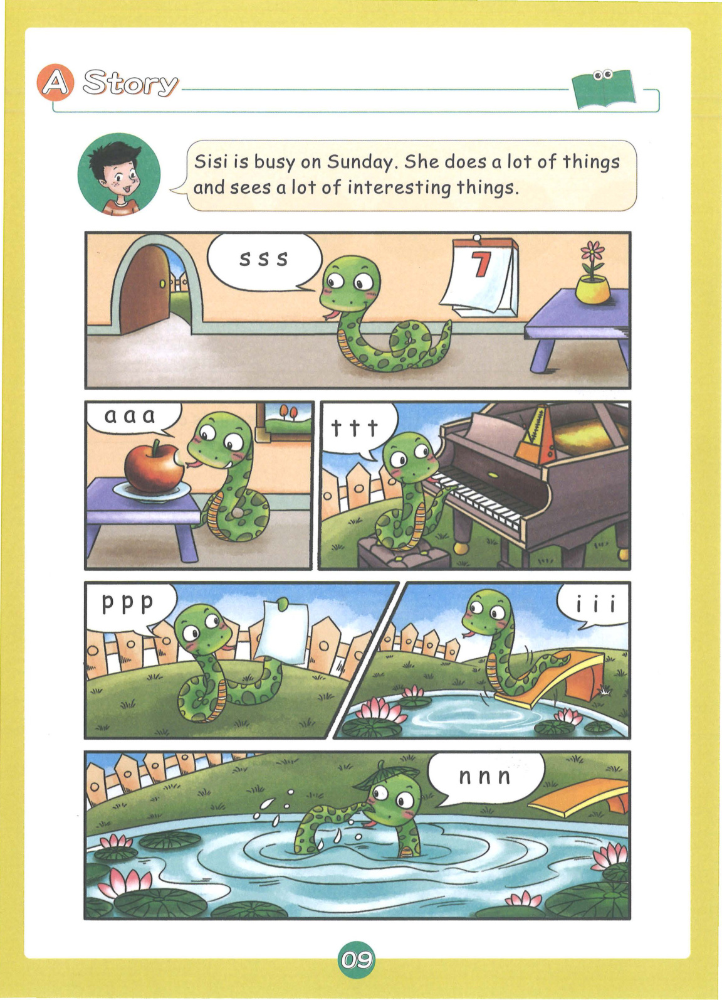
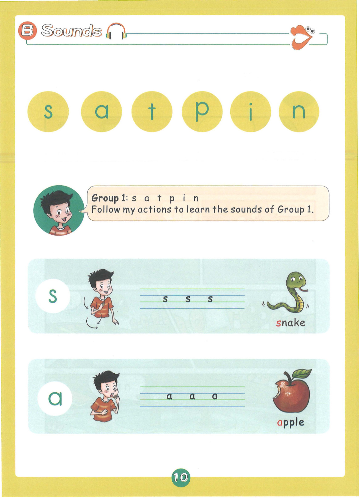
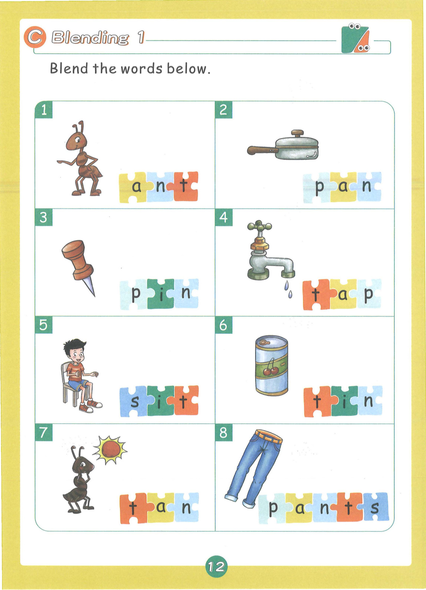
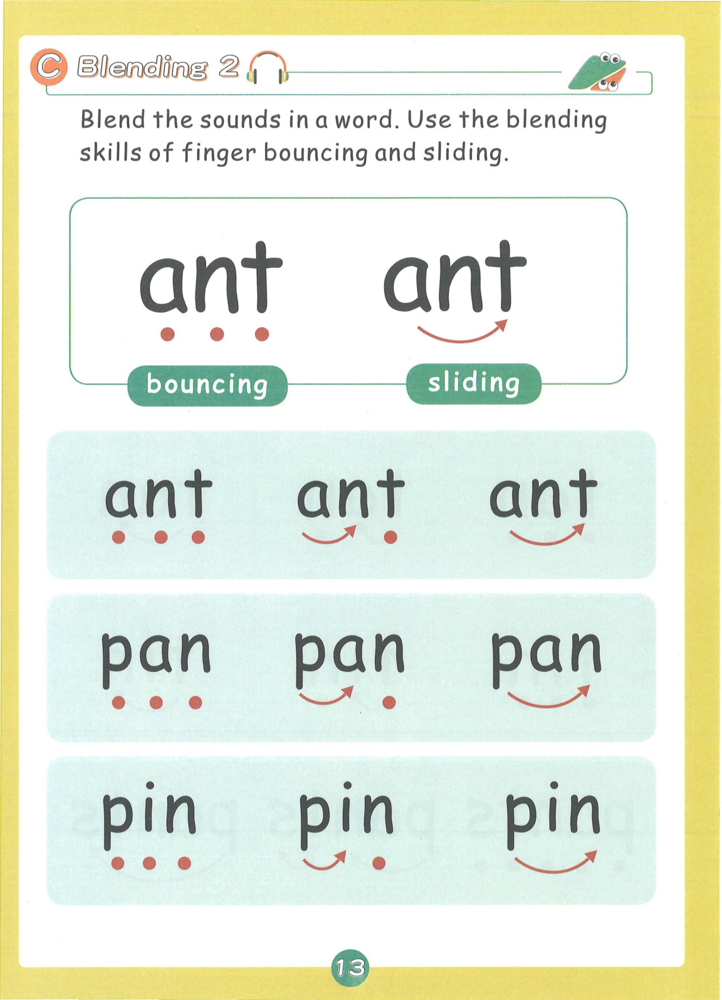
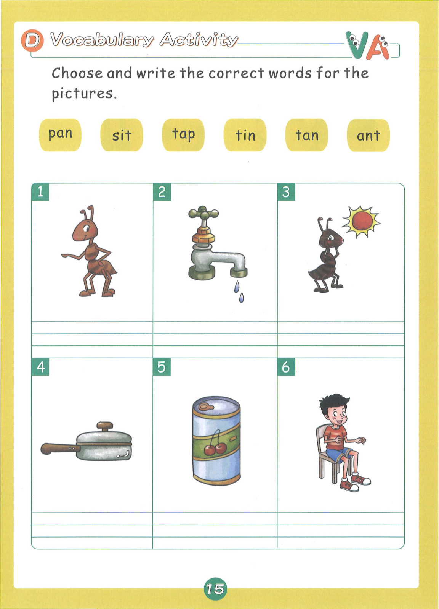
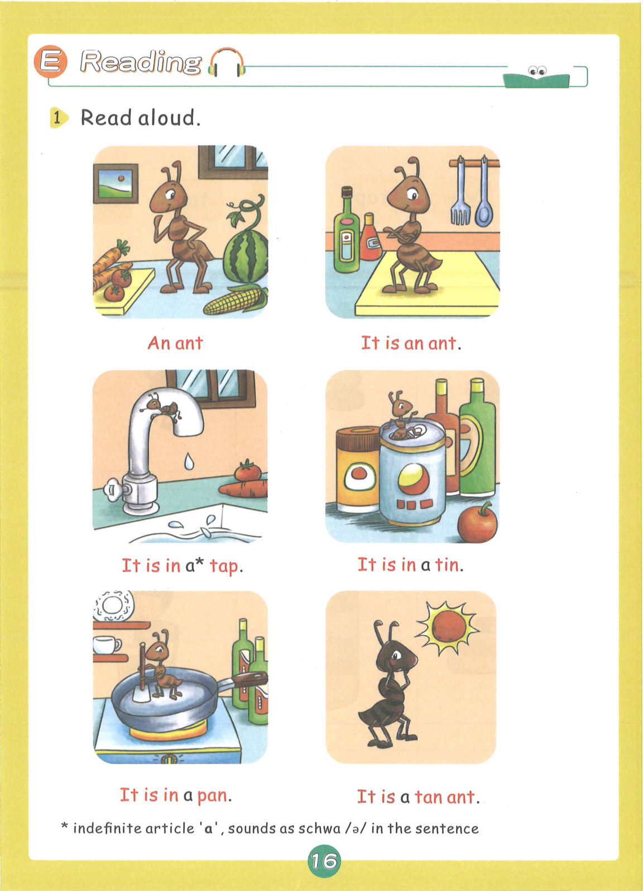
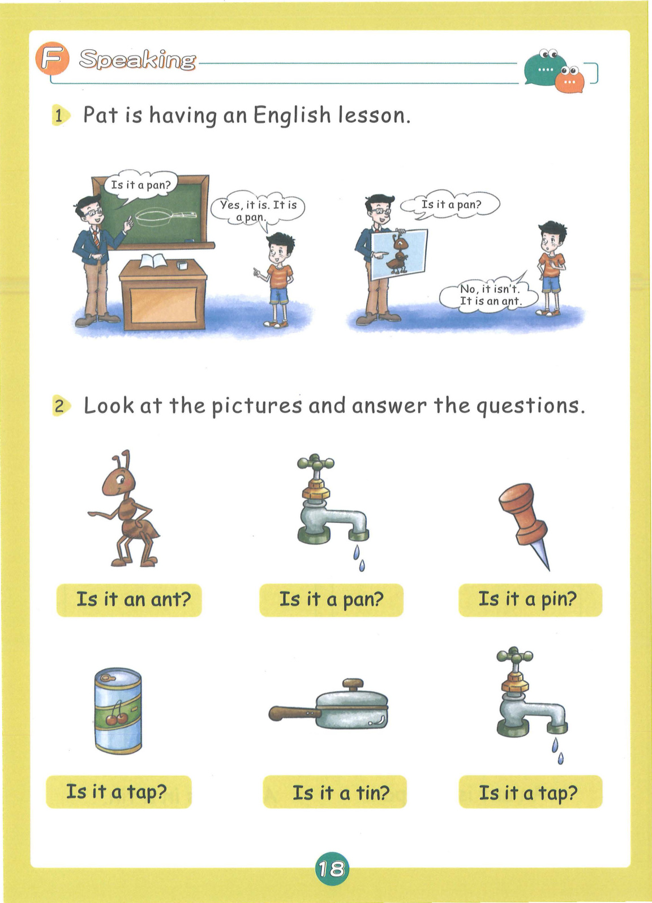
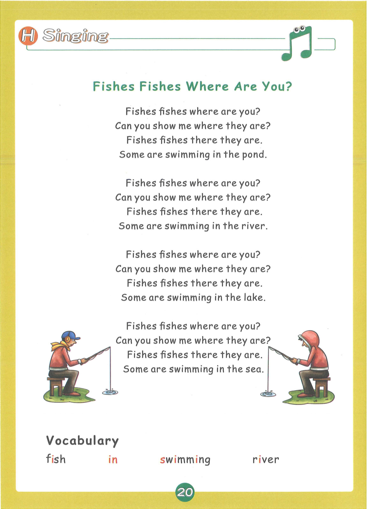

# Lesson 1: Group 1 - s a t p i n

> **教材页码**：第 11-24 页  
> **学习内容**：6个基础发音：s, a, t, p, i, n

---

## 📖 故事导入

**教材第 10 页**

### Sisi's Sunday

Sisi is busy on Sunday. She does a lot of things and sees a lot of interesting things.

> 思思周日很忙。她做了很多事情，也看到了很多有趣的东西。

---

## 🔤 发音学习

**教材第 11-12 页**

### 发音卡片

#### s — snake（蛇）

- **类型**：辅音
- **发音方法**：舌尖靠近上齿龈，气流从舌尖和齿龈间送出，摩擦成音，声带不振动。
- **动作提示**：双手做蛇形扭动，发出 s-s-s 的声音
- **教材页码**：第 11 页

#### a — apple（苹果）

- **类型**：元音
- **发音方法**：嘴巴张大，舌身放平，舌尖抵下齿，发短元音。
- **动作提示**：手指嘴巴，做咬苹果的动作，发出 a-a-a 的声音
- **教材页码**：第 11 页

#### t — tick-tock（滴答（钟表声））

- **类型**：辅音
- **发音方法**：舌尖抵上齿龈，气流冲开阻碍爆破而出，声带不振动。
- **动作提示**：手臂做钟摆动作，发出 tick-tock 的声音
- **教材页码**：第 12 页

#### p — paper（纸）

- **类型**：辅音
- **发音方法**：双唇紧闭，气流冲开双唇爆破而出，声带不振动。
- **动作提示**：双手拿纸抖动，发出 p-p-p 的声音
- **教材页码**：第 12 页

#### i — igloo（冰屋）

- **类型**：元音
- **发音方法**：嘴巴微张，舌位抬高，发短元音，短促有力。
- **动作提示**：双手搭成屋顶形状，发出 i-i-i 的声音
- **教材页码**：第 12 页

#### n — nose（鼻子）

- **类型**：辅音
- **发音方法**：舌尖抵上齿龈，气流从鼻腔送出，声带振动，鼻音。
- **动作提示**：手指鼻子，发出 n-n-n 的声音
- **教材页码**：第 12 页

---

## 📝 单词释义

**教材第 13 页**

| 单词 | 中文意思 |
|------|----------|
| ant | 蚂蚁 |
| snake | 蛇 |
| apple | 苹果 |
| pan | 平底锅 |
| tap | 水龙头 |
| pin | 别针 |
| tin | 罐子 |
| nose | 鼻子 |
| paper | 纸 |
| igloo | 冰屋 |
| sat | 坐 |
| nap | 小睡 |

---

## 🎯 拼读练习

**教材第 14 页**

### 含元音 a 的单词

- **ant** — 蚂蚁
- **pan** — 平底锅
- **tap** — 水龙头
- **pat** — 拍打
- **nap** — 小睡
- **sat** — 坐
- **tan** — 棕褐色
- **man** — 男人

### 含元音 i 的单词

- **pin** — 别针
- **tin** — 罐子
- **sit** — 坐
- **sip** — 啜饮
- **pit** — 坑
- **nip** — 捏
- **tip** — 顶端

### 混合拼读（辅音连缀）

- **spit** — 吐
- **spin** — 旋转
- **snip** — 剪
- **snap** — 咔嚓声
- **span** — 跨度
- **spat** — 吐（过去式）
- **pants** — 裤子

### 📚 词汇小贴士

本课核心词汇：**sit, sip, pat, spin, spit**

---

## ✍️ 书写练习

**教材第 16 页**

练习书写以下单词：

- ant
- pan
- tap
- tin
- sit
- nap

---

## 💬 句子练习

**教材第 17 页**

| 英文句子 | 中文翻译 |
|----------|----------|
| It is an ant. | 它是一只蚂蚁。 |
| It is in a tap. | 它在水龙头里。 |
| It is in a tin. | 它在罐子里。 |
| It is in a pan. | 它在平底锅里。 |
| It is a tan ant. | 它是一只棕褐色的蚂蚁。 |
| An ant is in a pan. | 一只蚂蚁在平底锅里。 |
| An ant is in a tin. | 一只蚂蚁在罐子里。 |
| Is it a tin? | 它是一个罐子吗？ |
| Is it a tap? | 它是一个水龙头吗？ |

> 💡 **学习提示**：大声朗读这些句子，注意单词的拼读和句子的语调。疑问句末尾语调上升，陈述句语调下降。

---

## 🗣️ 口语运用

**教材第 19 页**

**情景话题**：Pat正在上英语课

**练习对话**：

- **Teacher**: Where is...?
- **Student**: It is in/on/under...

---

## 🎵 拓展 + 儿歌

**教材第 21 页**

### 🐟 Fishes Fishes Where Are You?

Fishes fishes where are you?
Can you show me where they are?
Fishes fishes there they are.
Some are swimming in the pond.

Fishes fishes where are you?
Can you show me where they are?
Fishes fishes there they are.
Some are swimming in the river.

Fishes fishes where are you?
Can you show me where they are?
Fishes fishes there they are.
Some are swimming in the lake.

Fishes fishes where are you?
Can you show me where they are?
Fishes fishes there they are.
Some are swimming in the sea.

### 📖 儿歌词汇

| 单词 | 中文 |
|------|------|
| fish | 鱼 |
| swimming | 游泳 |
| river | 河流 |
| pond | 池塘 |
| lake | 湖泊 |
| sea | 大海 |

---

## 🎉 本课总结

- **发音**：6个基础发音：s, a, t, p, i, n
- **单词**：22+ 个单词
- **核心技能**：字母组合拼读、CVC单词拼读
- **儿歌**：🐟 Fishes Fishes Where Are You?

---

*本乐英语自然拼读 · Lesson 1 知识点整理*
