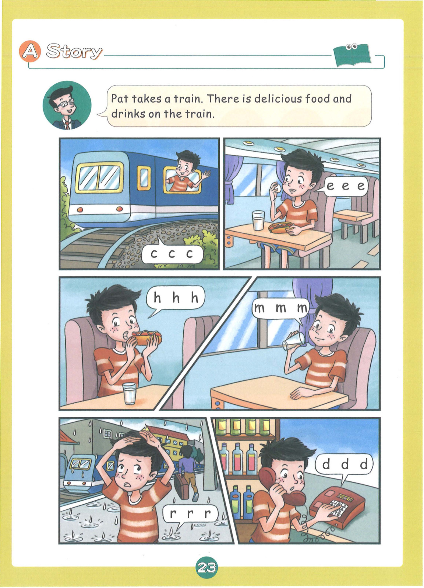
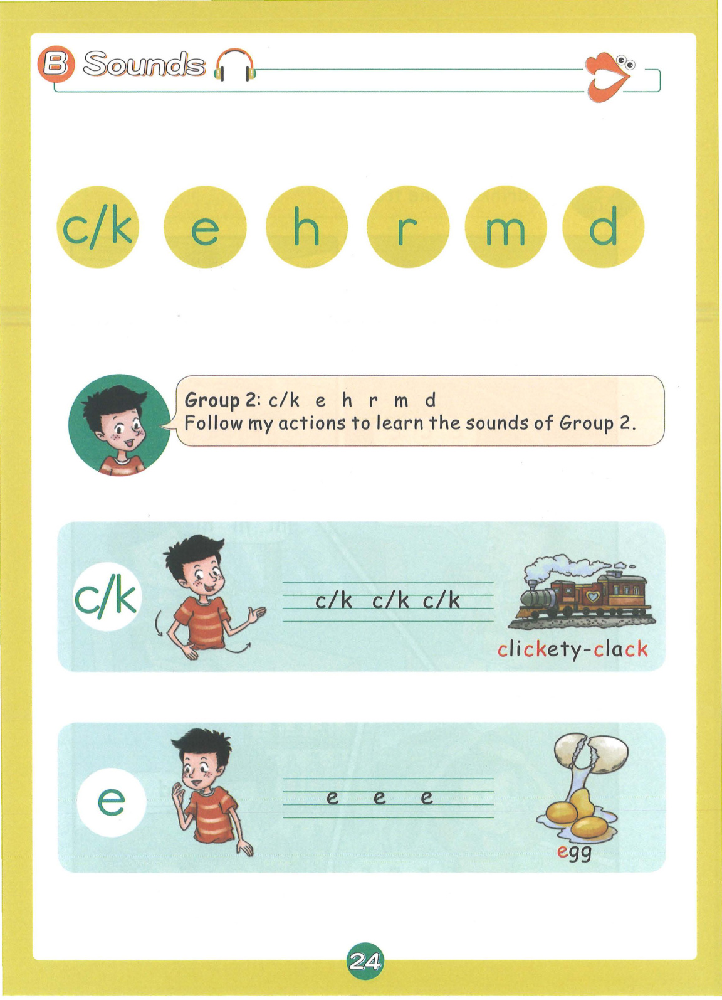
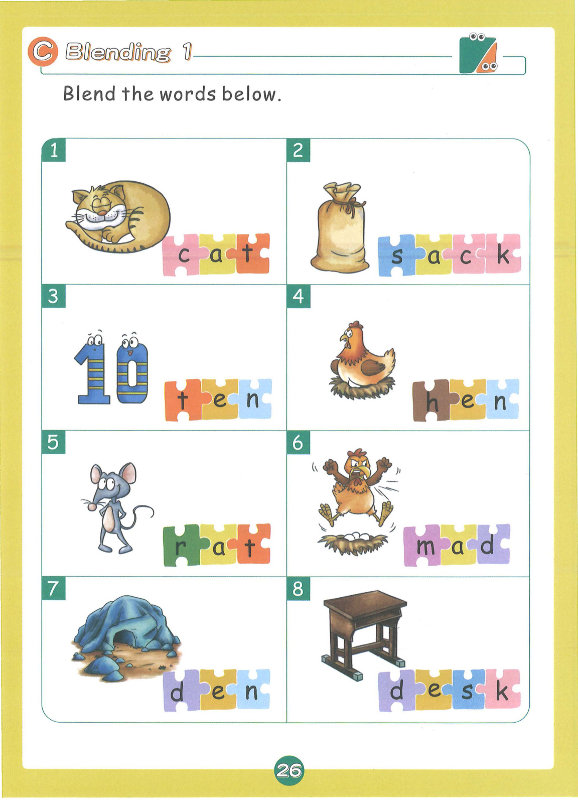
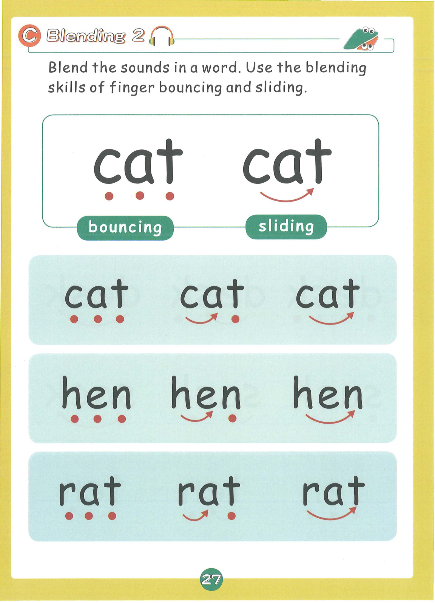
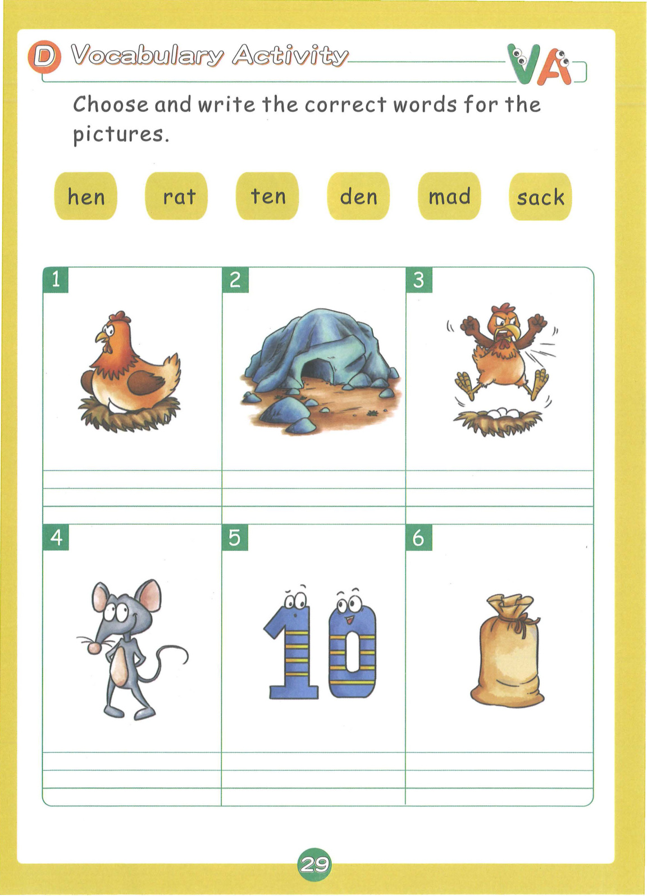
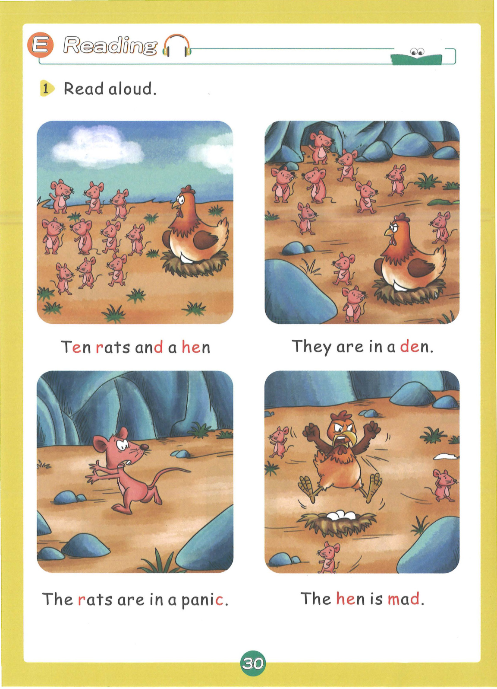
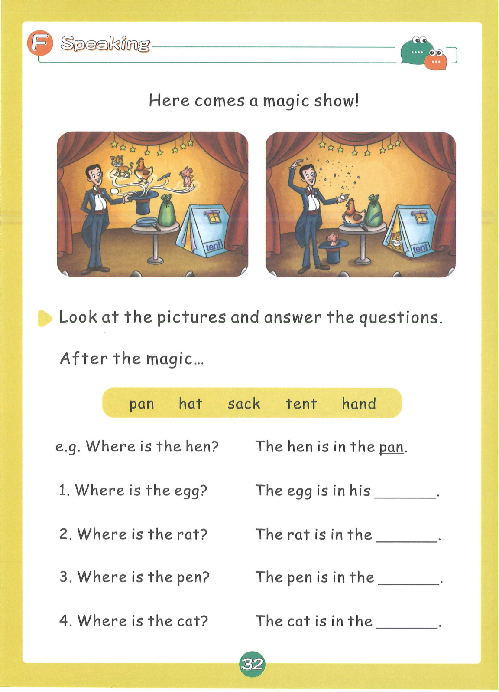
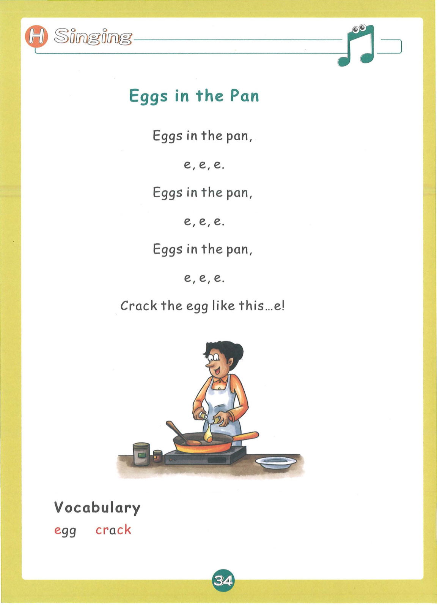

# Lesson 2: Group 2 - c/k e h r d m

> **教材页码**：第 25-38 页  
> **学习内容**：6个发音：c/k, e, h, r, d, m

---

## 📖 故事导入

**教材第 24 页**

### The Magic Show

Here comes a magic show! A magician does many amazing tricks with different objects.

> 魔术表演开始了！魔术师用不同的物品表演了许多神奇的戏法。

---

## 🔤 发音学习

**教材第 25-27 页**

### 发音卡片

#### c/k — clickety-clack（咔嗒声）

- **类型**：辅音
- **发音方法**：舌尖抵住软腭，气流冲开阻碍爆破而出，声带不振动。字母c和k都发这个音。
- **动作提示**：手指做敲击动作，发出 clickety-clack 的声音
- **教材页码**：第 25 页

#### e — egg（鸡蛋）

- **类型**：元音
- **发音方法**：嘴巴半开，舌位靠前，舌尖抵下齿，发短元音。
- **动作提示**：双手做蛋壳形状，做敲蛋动作，发出 e-e-e 的声音
- **教材页码**：第 25 页

#### h — hen（母鸡）

- **类型**：辅音
- **发音方法**：气流从声门摩擦而出，声带不振动，类似喘气声。
- **动作提示**：双手做翅膀扇动动作，发出 h-h-h 的声音
- **教材页码**：第 26 页

#### r — rat（老鼠）

- **类型**：辅音
- **发音方法**：舌尖向上卷起，靠近硬腭，气流从舌面送出，声带振动。
- **动作提示**：双手做老鼠耳朵形状，发出 r-r-r 的声音
- **教材页码**：第 26 页

#### d — dog（狗）

- **类型**：辅音
- **发音方法**：舌尖抵上齿龈，气流冲开阻碍爆破而出，声带振动。
- **动作提示**：双手做狗叫动作，发出 d-d-d 的声音
- **教材页码**：第 26 页

#### m — map（地图）

- **类型**：辅音
- **发音方法**：双唇紧闭，气流从鼻腔送出，声带振动，鼻音。
- **动作提示**：双手展开做地图形状，发出 m-m-m 的声音
- **教材页码**：第 27 页

---

## 📝 单词释义

**教材第 27 页**

| 单词 | 中文意思 |
|------|----------|
| cat | 猫 |
| hen | 母鸡 |
| rat | 老鼠 |
| dog | 狗 |
| egg | 鸡蛋 |
| map | 地图 |
| desk | 书桌 |
| sack | 麻袋 |
| ten | 十 |
| pen | 钢笔 |
| red | 红色 |
| hand | 手 |

---

## 🎯 拼读练习

**教材第 28 页**

### 含元音 e 的单词

- **hen** — 母鸡
- **ten** — 十
- **pen** — 钢笔
- **den** — 洞穴
- **red** — 红色
- **bed** — 床
- **pet** — 宠物
- **met** — 遇见
- **send** — 送
- **end** — 结束
- **step** — 脚步
- **men** — 男人们

### 含元音 a 的单词

- **cat** — 猫
- **rat** — 老鼠
- **mat** — 垫子
- **mad** — 疯狂的
- **can** — 能
- **man** — 男人
- **ham** — 火腿
- **sack** — 麻袋
- **hand** — 手
- **stand** — 站立
- **cap** — 帽子
- **stamp** — 邮票

### 混合拼读（辅音连缀）

- **tent** — 帐篷
- **cramp** — 抽筋
- **spend** — 花费
- **mist** — 薄雾
- **dip** — 蘸
- **hip** — 臀部
- **kid** — 小孩
- **hack** — 砍

### 📚 词汇小贴士

本课核心词汇：**am, is, are, can, send, spend**

---

## ✍️ 书写练习

**教材第 30 页**

练习书写以下单词：

- den
- mad
- sack
- tent
- hand
- red

---

## 💬 句子练习

**教材第 31 页**

| 英文句子 | 中文翻译 |
|----------|----------|
| Ten rats and a hen. | 十只老鼠和一只母鸡。 |
| They are in a den. | 它们在一个洞穴里。 |
| The rats are in a panic. | 老鼠们很惊慌。 |
| The hen is mad. | 母鸡很生气。 |
| Where is the hen? | 母鸡在哪里？ |
| The hen is in the pan. | 母鸡在平底锅里。 |
| Where is the egg? | 鸡蛋在哪里？ |
| The egg is in his hand. | 鸡蛋在他手里。 |
| Where is the cat? | 猫在哪里？ |
| The cat is in the tent. | 猫在帐篷里。 |

> 💡 **学习提示**：大声朗读这些句子，注意单词的拼读和句子的语调。疑问句末尾语调上升，陈述句语调下降。

---

## 🗣️ 口语运用

**教材第 33 页**

**情景话题**：魔术表演

**练习对话**：

- **Teacher**: Where is...?
- **Student**: It is in/on/under...

---

## 🎵 拓展 + 儿歌

**教材第 35 页**

### 🥚 Eggs in the Pan

Eggs in the pan,
e, e, e.
Eggs in the pan,
e, e, e.
Eggs in the pan,
e, e, e.
Crack the egg like this... e!

### 📖 儿歌词汇

| 单词 | 中文 |
|------|------|
| egg | 鸡蛋 |
| crack | 敲碎 |
| pan | 平底锅 |

---

## 🎉 本课总结

- **发音**：6个发音：c/k, e, h, r, d, m
- **单词**：32+ 个单词
- **核心技能**：字母组合拼读、CVC单词拼读
- **儿歌**：🥚 Eggs in the Pan

---

*本乐英语自然拼读 · Lesson 2 知识点整理*
