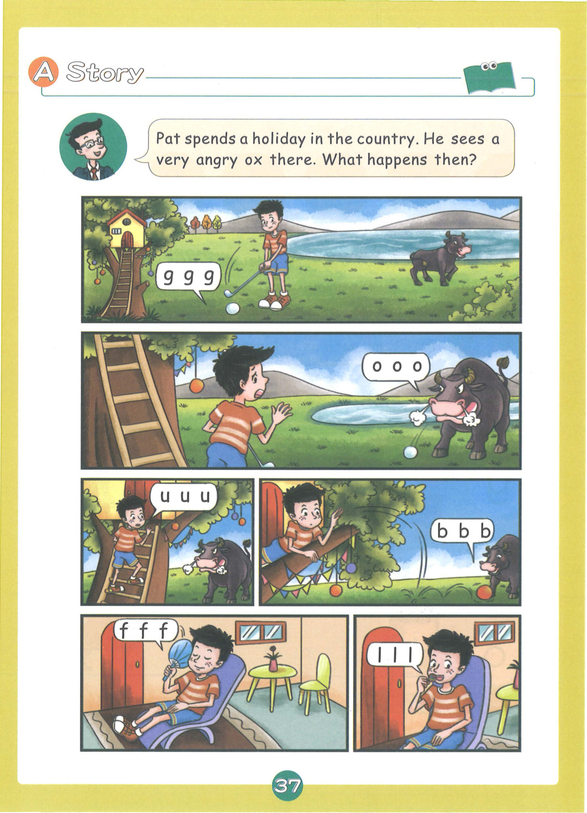
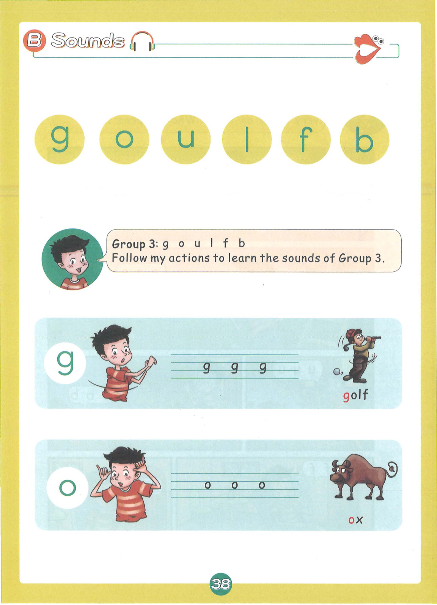
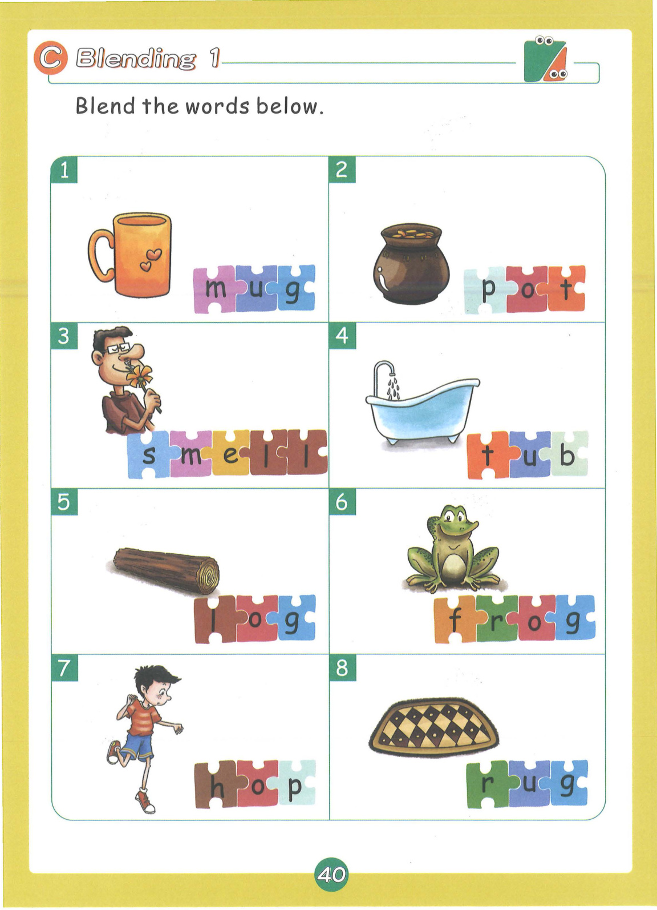
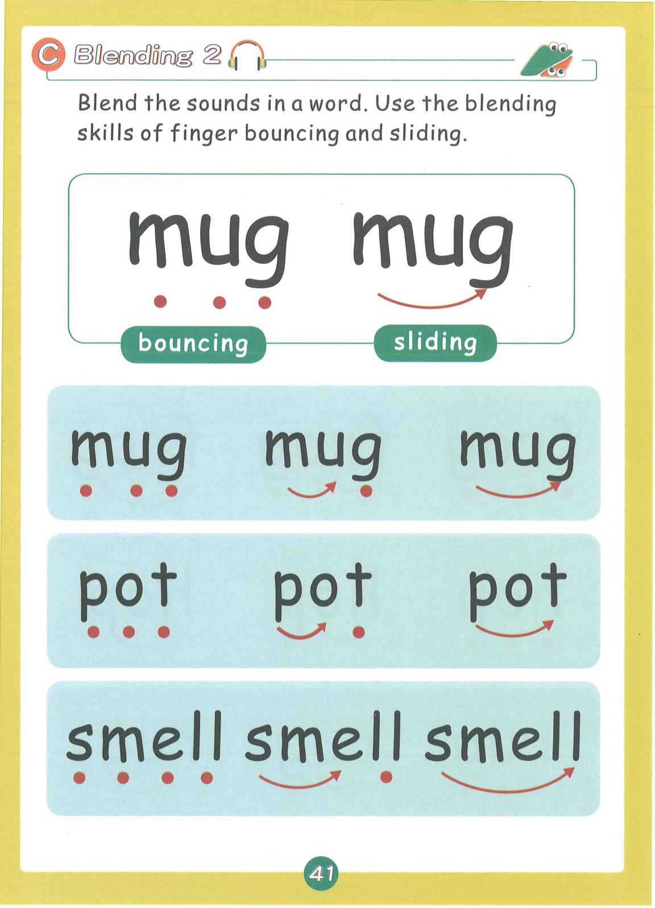
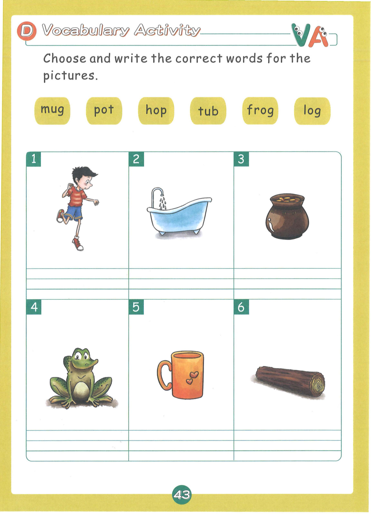
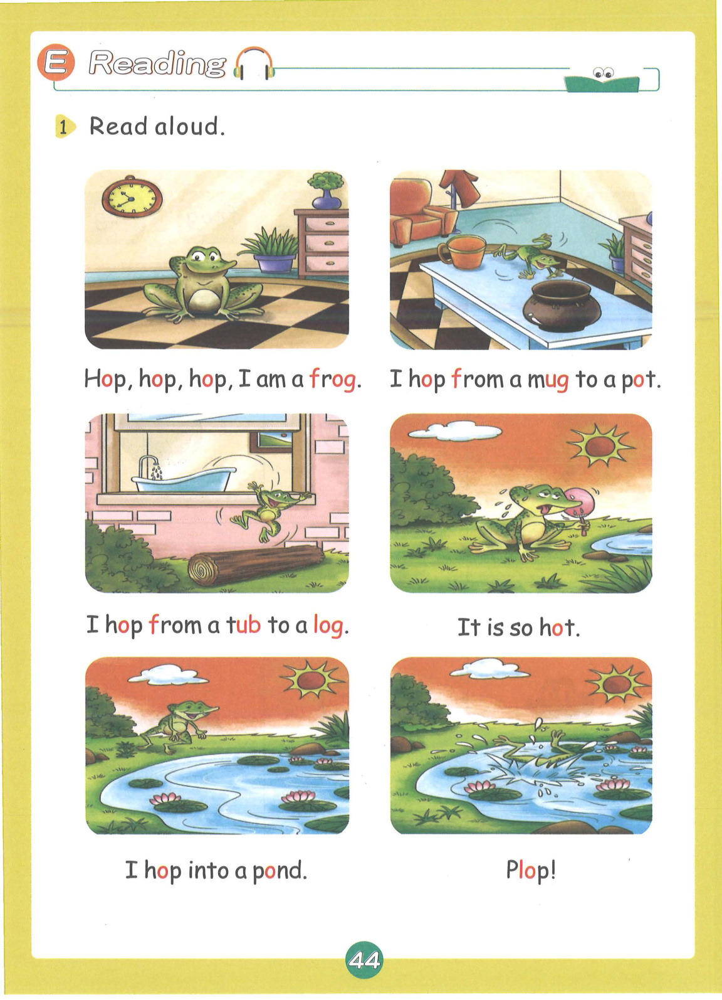
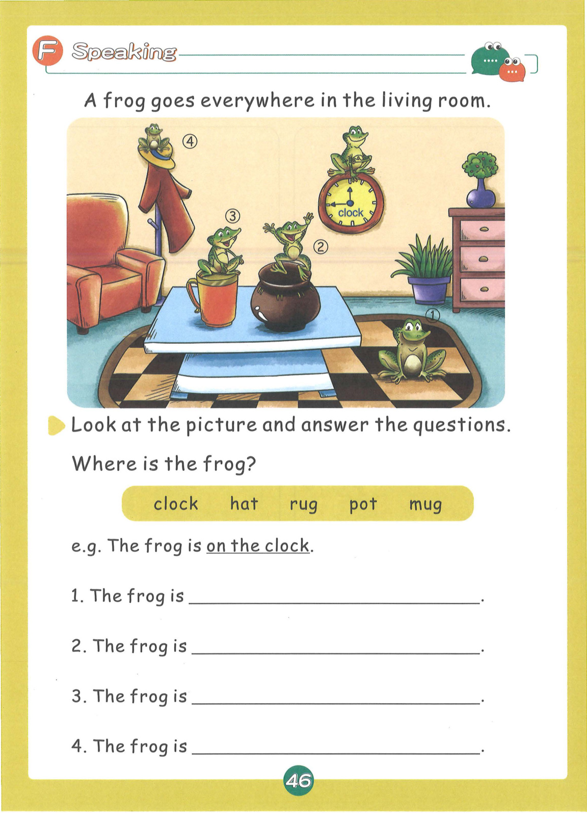
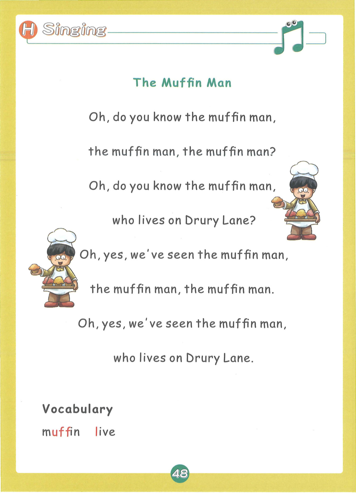

# Lesson 3: Group 3 - g o u l f b

> **教材页码**：第 39-52 页  
> **学习内容**：6个发音：g, o, u, l, f, b

---

## 📖 故事导入

**教材第 38 页**

### The Frog in the Living Room

A frog goes everywhere in the living room. It hops from place to place and sees many interesting things.

> 一只青蛙在客厅里到处跳。它从一个地方跳到另一个地方，看到了很多有趣的东西。

---

## 🔤 发音学习

**教材第 39-41 页**

### 发音卡片

#### g — golf（高尔夫）

- **类型**：辅音
- **发音方法**：舌后部抵住软腭，气流冲开阻碍爆破而出，声带振动。
- **动作提示**：双手做挥高尔夫球杆动作，发出 g-g-g 的声音
- **教材页码**：第 39 页

#### o — ox（公牛）

- **类型**：元音
- **发音方法**：嘴巴张圆，舌身后缩，舌尖离开下齿，发短元音。
- **动作提示**：双手做圆形，发出 o-o-o 的声音
- **教材页码**：第 39 页

#### u — umbrella（雨伞）

- **类型**：元音
- **发音方法**：嘴巴微张，舌身放平，发短元音，发音短促。
- **动作提示**：双手做撑伞动作，发出 u-u-u 的声音
- **教材页码**：第 40 页

#### l — lion（狮子）

- **类型**：辅音
- **发音方法**：舌尖抵上齿龈，气流从舌两侧送出，声带振动，舌侧音。
- **动作提示**：双手做狮子爪子动作，发出 l-l-l 的声音
- **教材页码**：第 40 页

#### f — fish（鱼）

- **类型**：辅音
- **发音方法**：上齿轻触下唇，气流从唇齿间摩擦而出，声带不振动。
- **动作提示**：双手做鱼游动动作，发出 f-f-f 的声音
- **教材页码**：第 40 页

#### b — boy（男孩）

- **类型**：辅音
- **发音方法**：双唇紧闭，气流冲开双唇爆破而出，声带振动。
- **动作提示**：双手拍球动作，发出 b-b-b 的声音
- **教材页码**：第 41 页

---

## 📝 单词释义

**教材第 41 页**

| 单词 | 中文意思 |
|------|----------|
| golf | 高尔夫 |
| ox | 公牛 |
| umbrella | 雨伞 |
| lion | 狮子 |
| fish | 鱼 |
| boy | 男孩 |
| frog | 青蛙 |
| mug | 杯子 |
| pot | 锅 |
| tub | 浴盆 |
| log | 原木 |
| pond | 池塘 |

---

## 🎯 拼读练习

**教材第 42 页**

### 含元音 o 的单词

- **hop** — 跳
- **pot** — 锅
- **log** — 原木
- **frog** — 青蛙
- **hot** — 热的
- **not** — 不
- **rot** — 腐烂
- **pop** — 弹出
- **stop** — 停止
- **lost** — 丢失
- **clock** — 时钟
- **frost** — 霜

### 含元音 u 的单词

- **mug** — 杯子
- **tub** — 浴盆
- **rug** — 小地毯
- **fun** — 乐趣
- **tug** — 拉
- **huff** — 吹气
- **puff** — 吹
- **gum** — 口香糖
- **bump** — 碰撞
- **drum** — 鼓
- **mud** — 泥巴
- **run** — 跑

### 混合拼读（辅音连缀）

- **bed** — 床
- **bell** — 铃铛
- **bit** — 一点
- **sell** — 卖
- **let** — 让
- **drop** — 掉落
- **flap** — 拍打
- **belt** — 皮带
- **lift** — 举起
- **pill** — 药丸
- **slim** — 苗条的
- **grab** — 抓住
- **hill** — 小山
- **tell** — 告诉
- **lamp** — 灯

### 📚 词汇小贴士

本课核心词汇：**hop, drop, stop, grab, lift**

---

## ✍️ 书写练习

**教材第 44 页**

练习书写以下单词：

- hop
- mug
- tub
- log
- frog
- pond

---

## 💬 句子练习

**教材第 45 页**

| 英文句子 | 中文翻译 |
|----------|----------|
| Hop, hop, hop! | 跳，跳，跳！ |
| I am a frog. | 我是一只青蛙。 |
| I hop from a mug to a pot. | 我从杯子跳到锅里。 |
| I hop from a tub to a log. | 我从浴盆跳到原木上。 |
| It is so hot. | 天太热了。 |
| I hop into a pond. | 我跳进池塘里。 |
| Plop! | 扑通！ |
| The frog is on the clock. | 青蛙在时钟上。 |
| A frog hops into a pond. | 一只青蛙跳进池塘。 |

> 💡 **学习提示**：大声朗读这些句子，注意单词的拼读和句子的语调。疑问句末尾语调上升，陈述句语调下降。

---

## 🗣️ 口语运用

**教材第 47 页**

**情景话题**：青蛙在哪里

**练习对话**：

- **Teacher**: Where is...?
- **Student**: It is in/on/under...

---

## 🎵 拓展 + 儿歌

**教材第 49 页**

### 🧁 The Muffin Man

Oh, do you know the muffin man,
the muffin man, the muffin man?
Oh, do you know the muffin man,
who lives on Drury Lane?

Oh, yes, we've seen the muffin man,
the muffin man, the muffin man.
Oh, yes, we've seen the muffin man,
who lives on Drury Lane.

### 📖 儿歌词汇

| 单词 | 中文 |
|------|------|
| muffin | 松饼 |
| live | 居住 |
| man | 男人 |

---

## 🎉 本课总结

- **发音**：6个发音：g, o, u, l, f, b
- **单词**：39+ 个单词
- **核心技能**：字母组合拼读、CVC单词拼读
- **儿歌**：🧁 The Muffin Man

---

*本乐英语自然拼读 · Lesson 3 知识点整理*
