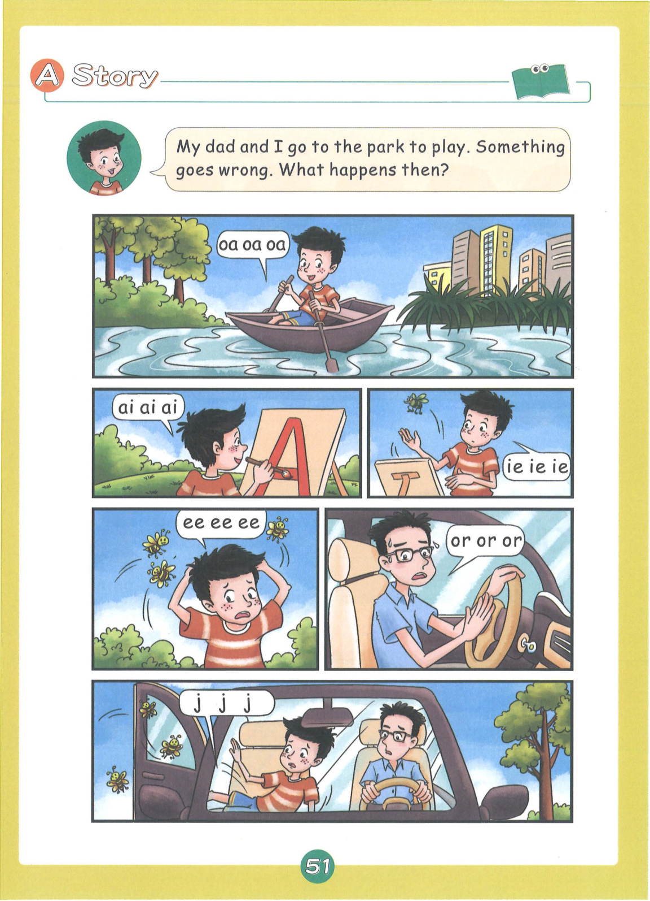
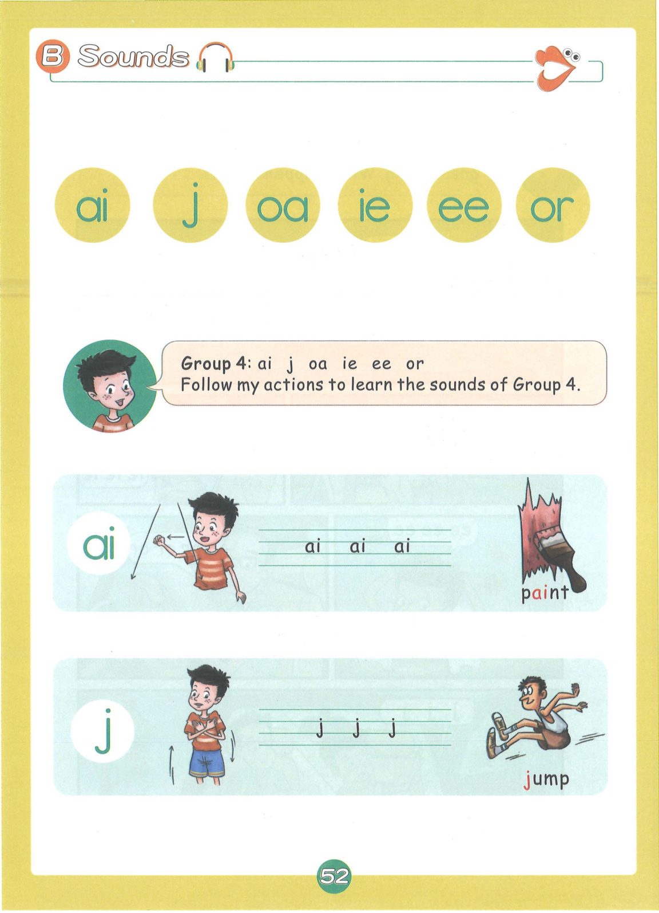
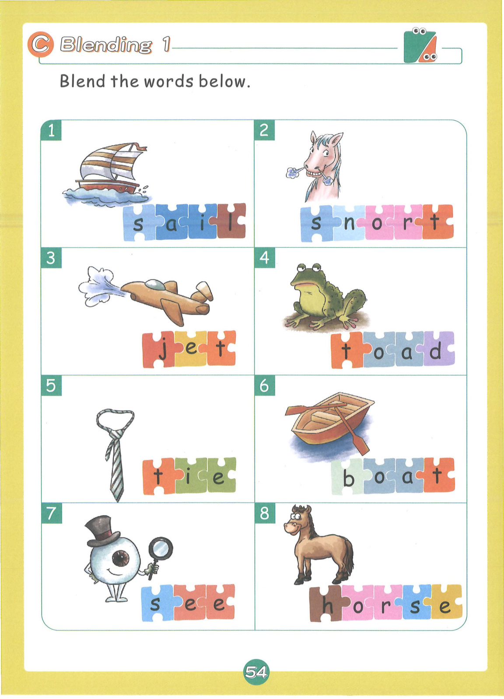
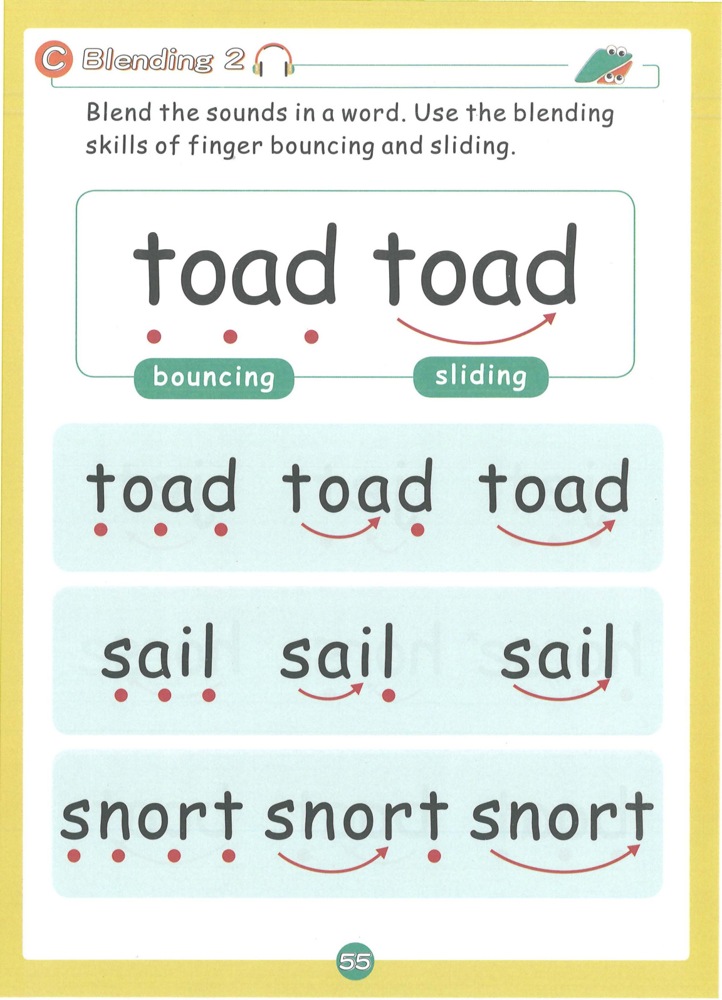
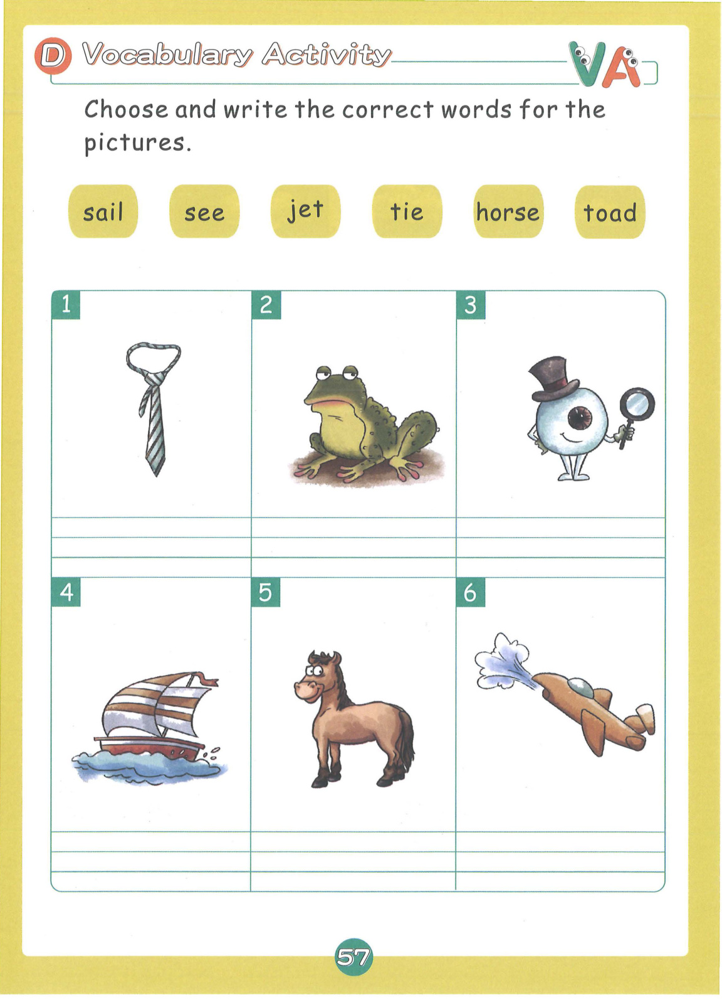
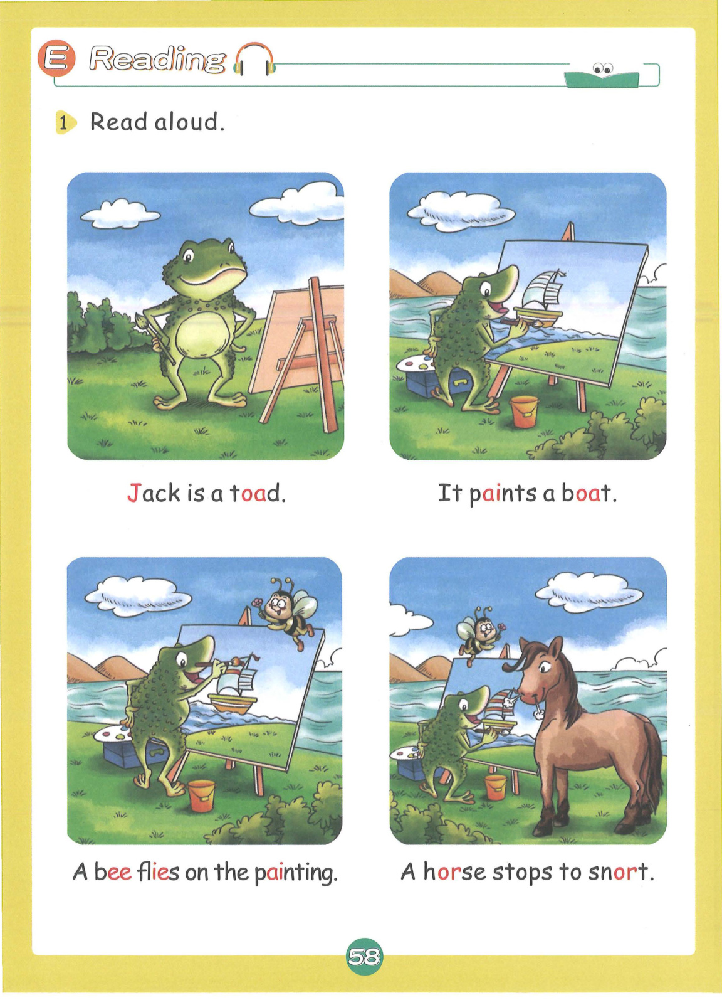
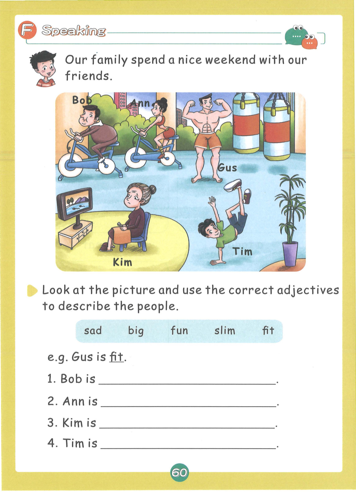
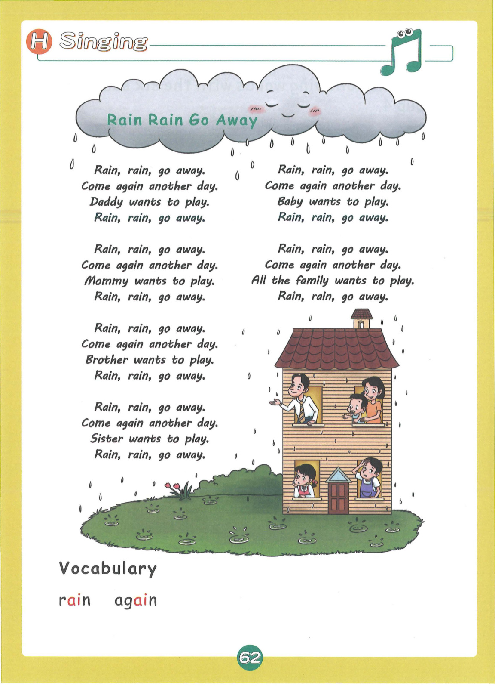

# Lesson 4: Group 4 - ai j oa ie ee or

> **教材页码**：第 53-66 页  
> **学习内容**：6个发音：ai, j, oa, ie, ee, or

---

## 📖 故事导入

**教材第 52 页**

### Jack the Toad

Jack is a toad. He paints a beautiful boat. A bee flies on the painting, and even a horse stops to see.

> 杰克是一只蟾蜍。他画了一艘漂亮的船。一只蜜蜂飞到了画上，甚至一匹马也停下来看。

---

## 🔤 发音学习

**教材第 53-55 页**

### 发音卡片

#### ai — rain（雨）

- **类型**：字母组合
- **发音方法**：两个字母一起发长元音/ei/的音，a发音i不发音。
- **动作提示**：双手做下雨动作，发出 ai-ai-ai 的声音
- **教材页码**：第 53 页

#### j — jump（跳）

- **类型**：辅音
- **发音方法**：舌尖抵上齿龈后部，气流冲出摩擦成音，声带振动。
- **动作提示**：做跳跃动作，发出 j-j-j 的声音
- **教材页码**：第 53 页

#### oa — boat（船）

- **类型**：字母组合
- **发音方法**：两个字母一起发长元音/ou/的音，o发音a不发音。
- **动作提示**：双手做划船动作，发出 oa-oa-oa 的声音
- **教材页码**：第 54 页

#### ie — pie（馅饼）

- **类型**：字母组合
- **发音方法**：两个字母一起发长元音/ai/的音，i发音e不发音。
- **动作提示**：双手做吃馅饼动作，发出 ie-ie-ie 的声音
- **教材页码**：第 54 页

#### ee — bee（蜜蜂）

- **类型**：字母组合
- **发音方法**：两个字母一起发长元音/i:/的音，长而清晰。
- **动作提示**：双手做蜜蜂飞行动作，发出 ee-ee-ee 的声音
- **教材页码**：第 54 页

#### or — horn（号角）

- **类型**：R控制元音
- **发音方法**：r控制元音，o的发音受r影响，发长音/ɔr/。
- **动作提示**：双手做吹号角动作，发出 or-or-or 的声音
- **教材页码**：第 55 页

---

## 📝 单词释义

**教材第 55 页**

| 单词 | 中文意思 |
|------|----------|
| rain | 雨 |
| jump | 跳 |
| boat | 船 |
| pie | 馅饼 |
| bee | 蜜蜂 |
| horn | 号角 |
| toad | 蟾蜍 |
| sail | 航行 |
| jeep | 吉普车 |
| sleep | 睡觉 |
| green | 绿色 |
| horse | 马 |

---

## 🎯 拼读练习

**教材第 56 页**

### 含 ai 的单词

- **rain** — 雨
- **sail** — 航行
- **nail** — 钉子
- **tail** — 尾巴
- **mail** — 邮件
- **brain** — 大脑
- **train** — 火车
- **pain** — 疼痛

### 含 oa 的单词

- **boat** — 船
- **toad** — 蟾蜍
- **road** — 路
- **soap** — 肥皂
- **coat** — 外套
- **goal** — 目标
- **loaf** — 一条面包
- **moan** — 呻吟

### 含 ee 的单词

- **bee** — 蜜蜂
- **see** — 看见
- **sleep** — 睡觉
- **meet** — 遇见
- **beef** — 牛肉
- **green** — 绿色
- **jeep** — 吉普车
- **need** — 需要

### 含 ie 的单词

- **pie** — 馅饼
- **die** — 死
- **tie** — 领带
- **lie** — 躺
- **fries** — 薯条
- **cries** — 哭

### 含 or 的单词

- **horn** — 号角
- **fork** — 叉子
- **pork** — 猪肉
- **corn** — 玉米
- **form** — 形式
- **sport** — 运动
- **snort** — 哼鼻子
- **roast** — 烤

### 📚 词汇小贴士

本课核心词汇：**rain, sleep, meet, roast, jump, snort**

---

## ✍️ 书写练习

**教材第 58 页**

练习书写以下单词：

- rain
- boat
- bee
- horse
- sleep
- fork

---

## 💬 句子练习

**教材第 59 页**

| 英文句子 | 中文翻译 |
|----------|----------|
| Jack is a toad. | 杰克是一只蟾蜍。 |
| It paints a boat. | 它画了一艘船。 |
| A bee flies on the painting. | 一只蜜蜂飞到了画上。 |
| A horse stops to snort. | 一匹马停下来哼鼻子。 |
| Rain, rain, go away! | 雨啊雨，快走开！ |
| Come again another day. | 改天再来吧。 |
| Daddy wants to play. | 爸爸想出去玩。 |
| Mommy wants to play. | 妈妈想出去玩。 |

> 💡 **学习提示**：大声朗读这些句子，注意单词的拼读和句子的语调。疑问句末尾语调上升，陈述句语调下降。

---

## 🗣️ 口语运用

**教材第 61 页**

**情景话题**：描述人物

**练习对话**：

- **Teacher**: Where is...?
- **Student**: It is in/on/under...

---

## 🎵 拓展 + 儿歌

**教材第 63 页**

### 🌧️ Rain, Rain, Go Away

Rain, rain, go away.
Come again another day.
Daddy wants to play.
Rain, rain, go away.

Rain, rain, go away.
Come again another day.
Mommy wants to play.
Rain, rain, go away.

Rain, rain, go away.
Come again another day.
Brother wants to play.
Rain, rain, go away.

Rain, rain, go away.
Come again another day.
Sister wants to play.
Rain, rain, go away.

Rain, rain, go away.
Come again another day.
Baby wants to play.
Rain, rain, go away.

### 📖 儿歌词汇

| 单词 | 中文 |
|------|------|
| rain | 雨 |
| again | 再，又 |
| play | 玩 |
| daddy | 爸爸 |
| mommy | 妈妈 |
| brother | 哥哥/弟弟 |

---

## 🎉 本课总结

- **发音**：6个发音：ai, j, oa, ie, ee, or
- **单词**：38+ 个单词
- **核心技能**：字母组合拼读、CVC单词拼读
- **儿歌**：🌧️ Rain, Rain, Go Away

---

*本乐英语自然拼读 · Lesson 4 知识点整理*
