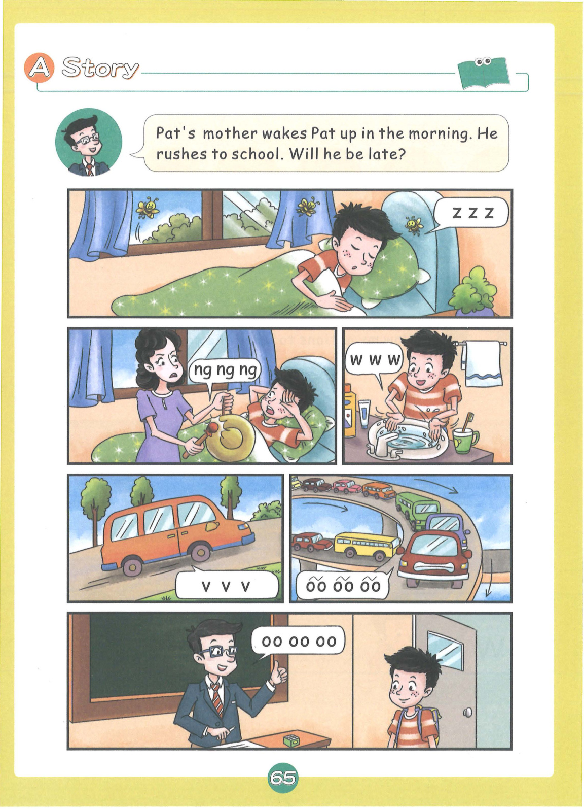
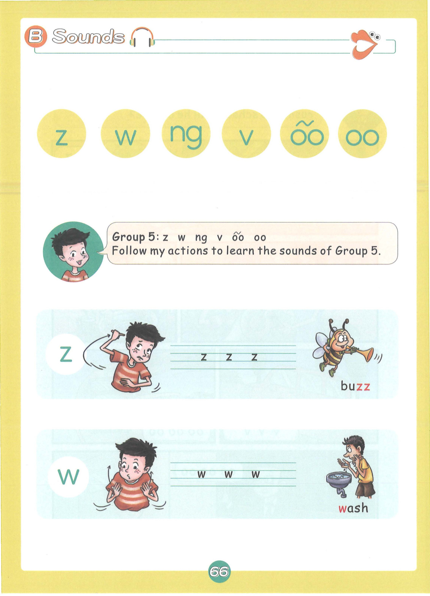
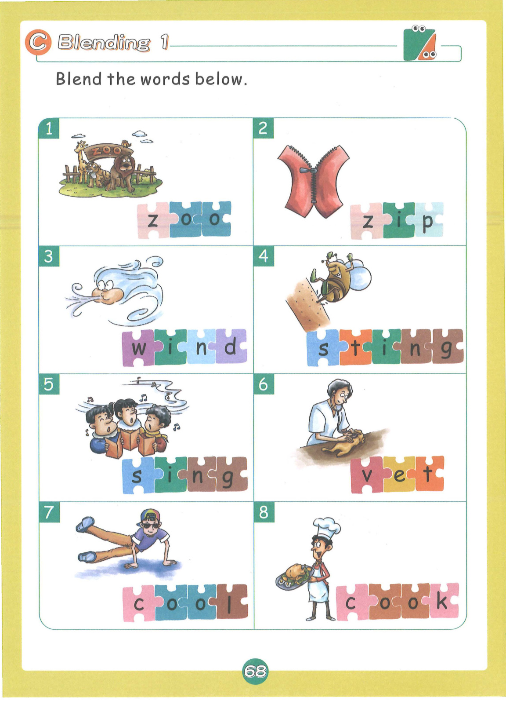
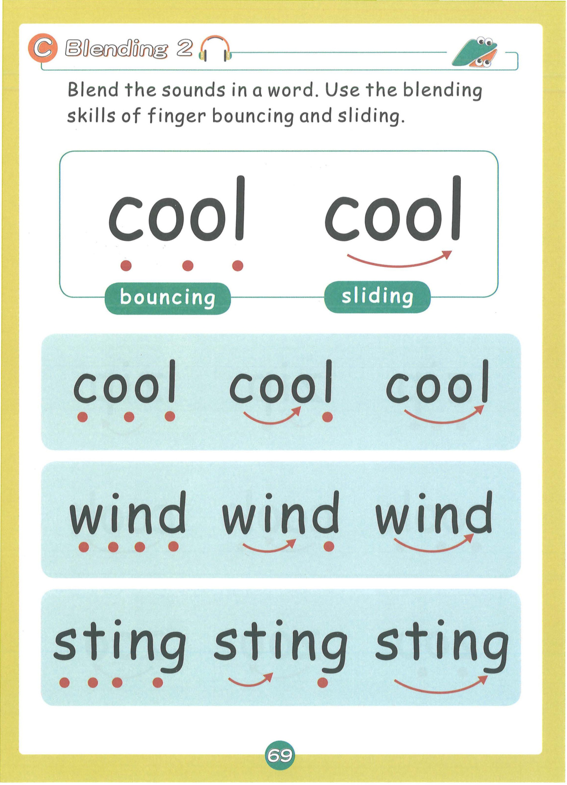
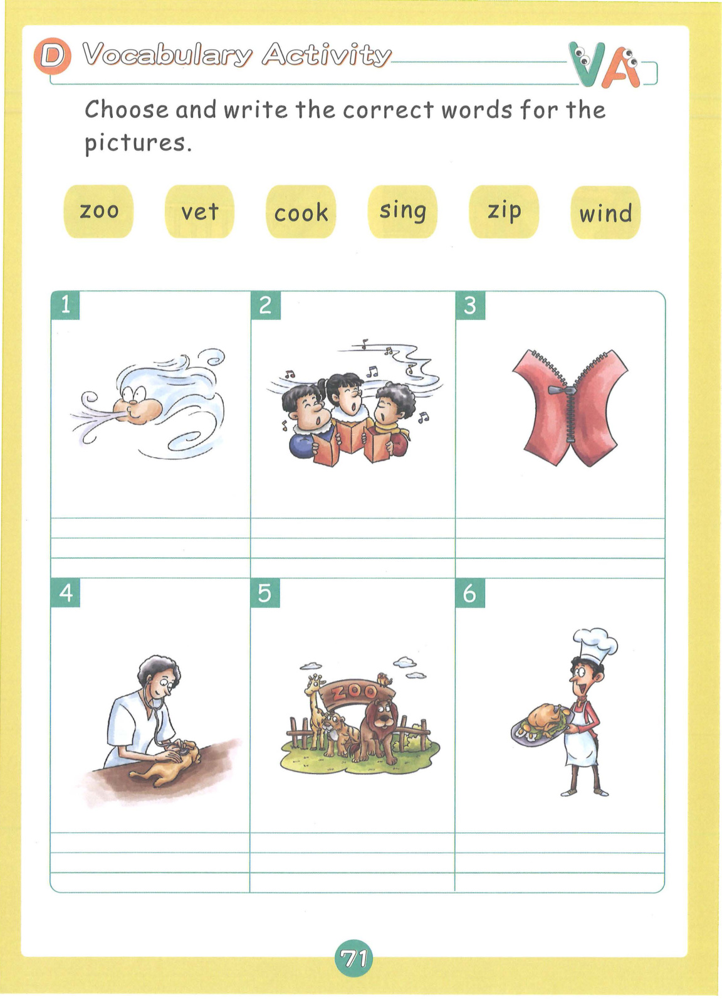
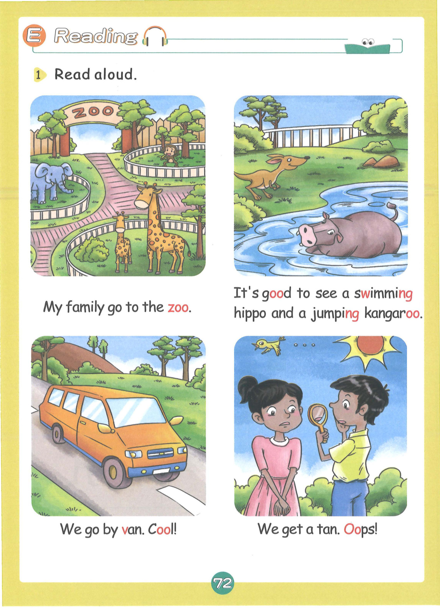
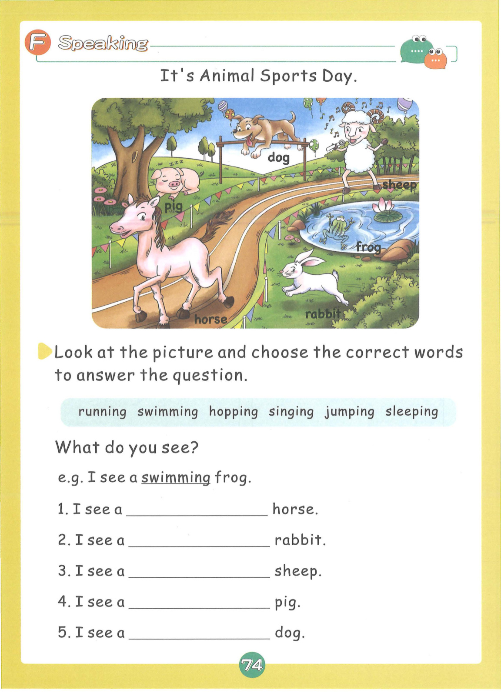
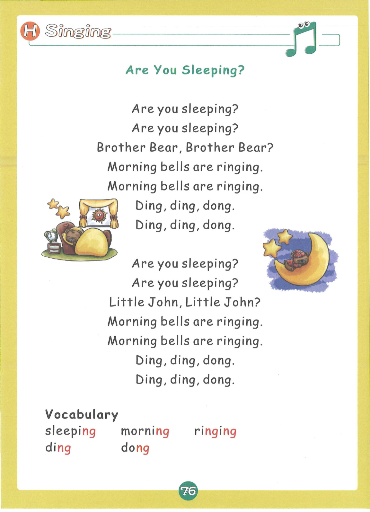

# Lesson 5: Group 5 - z w ng v oo oo

> **教材页码**：第 67-80 页  
> **学习内容**：6个发音：z, w, ng, v, oo(短音), oo(长音)

---

## 📖 故事导入

**教材第 66 页**

### Zig Zag the Zebra

Zig Zag is a zebra. He loves buzzing around and meeting new friends like vultures and wasps.

> Zig Zag是一只斑马。他喜欢到处嗡嗡转，认识秃鹰和黄蜂等新朋友。

---

## 🔤 发音学习

**教材第 67-69 页**

### 发音卡片

#### z — buzz（嗡嗡声）

- **类型**：辅音
- **发音方法**：舌尖靠近上齿龈，气流从舌尖和齿龈间送出，摩擦成音，声带振动。
- **动作提示**：双手做蜜蜂嗡嗡飞动作，发出 z-z-z 的声音
- **教材页码**：第 67 页

#### w — wash（洗）

- **类型**：辅音
- **发音方法**：双唇收圆突出，舌身后缩，气流从双唇间摩擦而出，声带振动。
- **动作提示**：双手做洗手动作，发出 w-w-w 的声音
- **教材页码**：第 67 页

#### ng — sing（唱歌）

- **类型**：字母组合
- **发音方法**：舌后部抵住软腭，气流从鼻腔送出，声带振动，后鼻音。
- **动作提示**：双手做唱歌动作，发出 ng-ng-ng 的声音
- **教材页码**：第 68 页

#### v — van（面包车）

- **类型**：辅音
- **发音方法**：上齿轻触下唇，气流从唇齿间摩擦而出，声带振动。
- **动作提示**：双手做开车动作，发出 v-v-v 的声音
- **教材页码**：第 68 页

#### oo (短) — book（书）

- **类型**：字母组合
- **发音方法**：两个字母oo发短元音，嘴唇收圆，发音短促。
- **动作提示**：双手做翻书动作，发出短音 oo
- **教材页码**：第 68 页

#### oo (长) — moon（月亮）

- **类型**：字母组合
- **发音方法**：两个字母oo发长元音/u:/，嘴唇收圆突出，发音长而清晰。
- **动作提示**：双手做月亮形状，发出长音 oo-o-o
- **教材页码**：第 69 页

---

## 📝 单词释义

**教材第 69 页**

| 单词 | 中文意思 |
|------|----------|
| zebra | 斑马 |
| buzz | 嗡嗡声 |
| wash | 洗 |
| wasp | 黄蜂 |
| sing | 唱歌 |
| van | 面包车 |
| book | 书 |
| moon | 月亮 |
| vulture | 秃鹰 |
| king | 国王 |
| zip | 拉链 |
| look | 看 |

---

## 🎯 拼读练习

**教材第 70 页**

### 含 ng 的单词

- **sing** — 唱歌
- **ring** — 铃声
- **king** — 国王
- **wing** — 翅膀
- **swing** — 摇摆
- **bring** — 带来
- **thing** — 东西
- **song** — 歌曲

### 含 oo (短音) 的单词

- **book** — 书
- **look** — 看
- **cook** — 做饭
- **hook** — 钩子
- **wood** — 木头
- **foot** — 脚
- **good** — 好的
- **stood** — 站

### 含 oo (长音) 的单词

- **moon** — 月亮
- **soon** — 很快
- **zoo** — 动物园
- **food** — 食物
- **room** — 房间
- **spoon** — 勺子
- **goose** — 鹅
- **tooth** — 牙齿

### 含 v 的单词

- **van** — 面包车
- **vet** — 兽医
- **vest** — 背心
- **vase** — 花瓶
- **vine** — 藤蔓
- **vote** — 投票

### 含 w 的单词

- **wash** — 洗
- **wasp** — 黄蜂
- **wig** — 假发
- **web** — 蜘蛛网
- **wet** — 湿的
- **win** — 赢

### 📚 词汇小贴士

本课核心词汇：**sing, wash, bring, swing, cook, look**

---

## ✍️ 书写练习

**教材第 72 页**

练习书写以下单词：

- sing
- book
- moon
- van
- wash
- zoo

---

## 💬 句子练习

**教材第 73 页**

| 英文句子 | 中文翻译 |
|----------|----------|
| Zig Zag is a zebra. | Zig Zag是一只斑马。 |
| The wasp is buzzing. | 黄蜂在嗡嗡叫。 |
| I can sing a song. | 我会唱一首歌。 |
| The van is red. | 面包车是红色的。 |
| I read a book. | 我读一本书。 |
| The moon is big. | 月亮很大。 |
| Look at the vulture! | 看那只秃鹰！ |
| Wash your hands. | 洗洗你的手。 |

> 💡 **学习提示**：大声朗读这些句子，注意单词的拼读和句子的语调。疑问句末尾语调上升，陈述句语调下降。

---

## 🗣️ 口语运用

**教材第 75 页**

**情景话题**：你会做什么

**练习对话**：

- **Teacher**: Where is...?
- **Student**: It is in/on/under...

---

## 🎵 拓展 + 儿歌

**教材第 77 页**

### 🎶 If You're Happy and You Know It

If you're happy and you know it, clap your hands.
If you're happy and you know it, clap your hands.
If you're happy and you know it,
then your face will surely show it.
If you're happy and you know it, clap your hands.

If you're happy and you know it, stamp your feet.
If you're happy and you know it, stamp your feet.
If you're happy and you know it,
then your face will surely show it.
If you're happy and you know it, stamp your feet.

### 📖 儿歌词汇

| 单词 | 中文 |
|------|------|
| happy | 开心的 |
| clap | 拍手 |
| stamp | 跺脚 |
| hands | 手 |
| feet | 脚 |
| know | 知道 |

---

## 🎉 本课总结

- **发音**：6个发音：z, w, ng, v, oo(短音), oo(长音)
- **单词**：36+ 个单词
- **核心技能**：字母组合拼读、CVC单词拼读
- **儿歌**：🎶 If You're Happy and You Know It

---

*本乐英语自然拼读 · Lesson 5 知识点整理*
