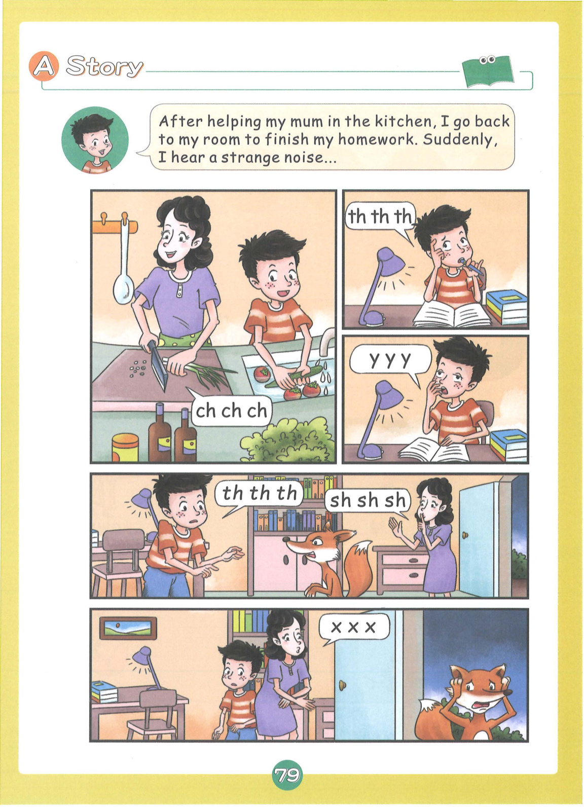
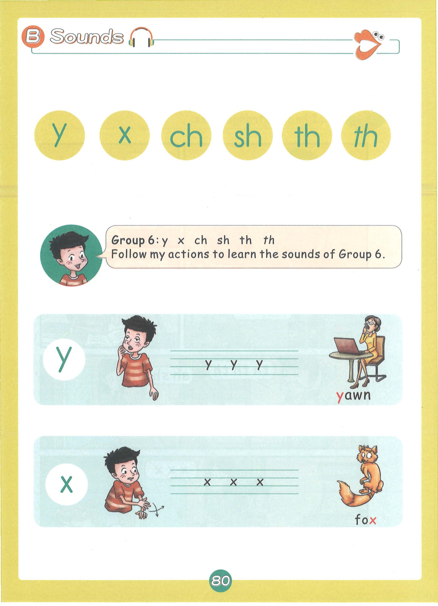
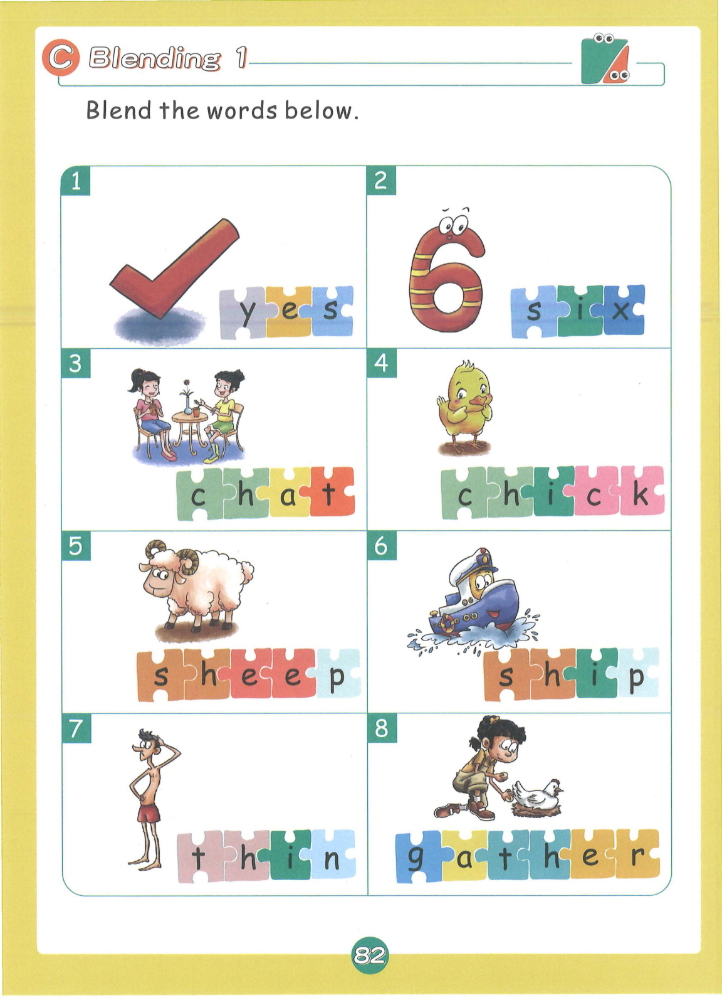
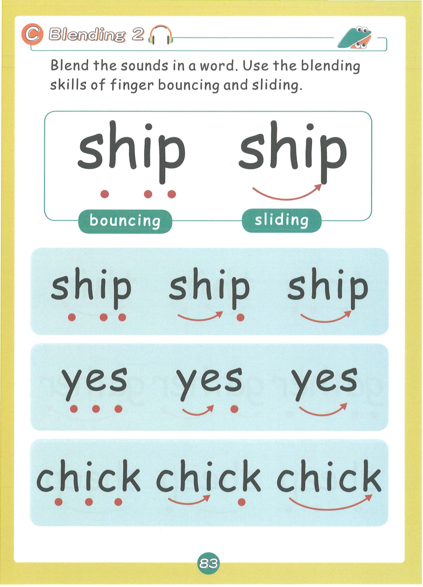
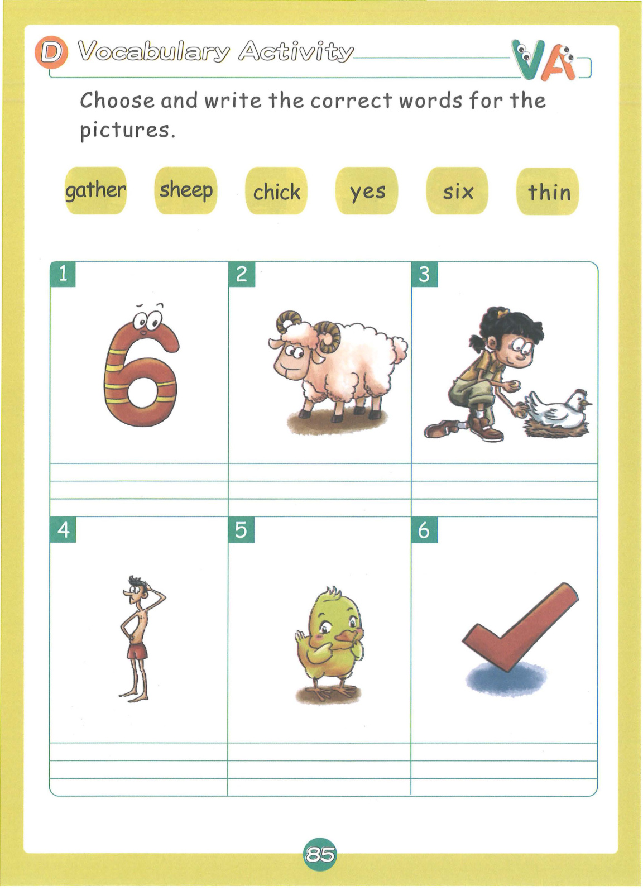
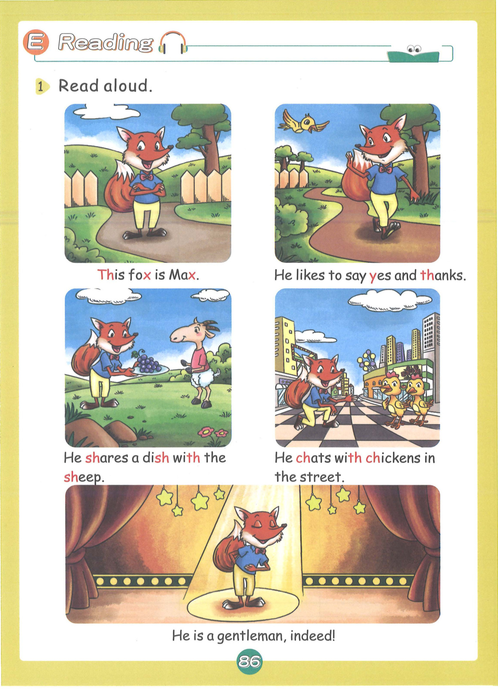
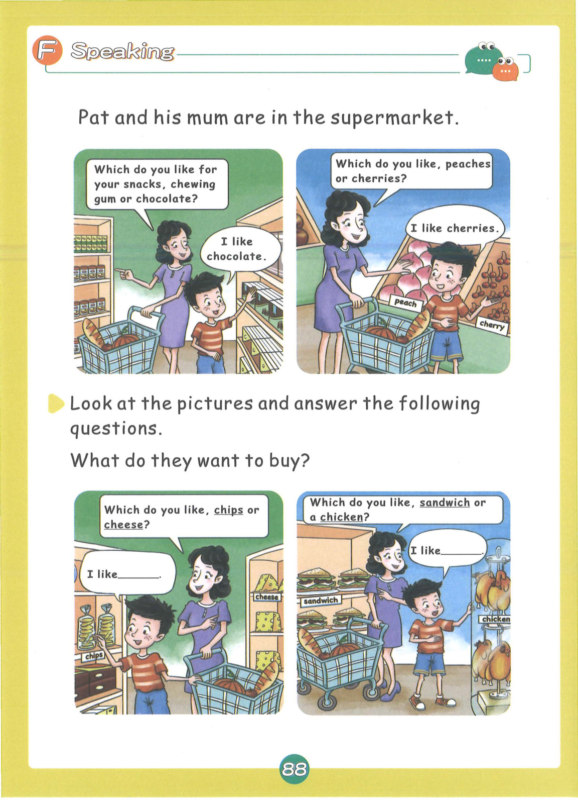
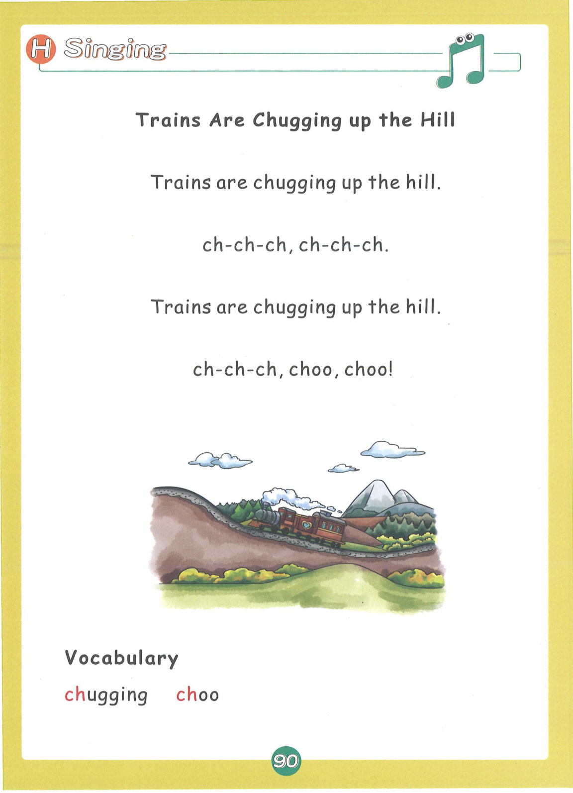

# Lesson 6: Group 6 - y x ch sh th th

> **教材页码**：第 81-94 页  
> **学习内容**：6个发音：y, x, ch, sh, th(清辅音), th(浊辅音)

---

## 📖 故事导入

**教材第 80 页**

### Yawn the Fox

A fox feels sleepy and yawns a lot. He sits on a chair by the ship and watches the sea.

> 一只狐狸觉得很困，打了很多哈欠。他坐在船边的椅子上看大海。

---

## 🔤 发音学习

**教材第 81-83 页**

### 发音卡片

#### y — yawn（打哈欠）

- **类型**：辅音
- **发音方法**：舌前部向硬腭抬起，气流从舌面和硬腭间摩擦而出，声带振动。
- **动作提示**：双手做打哈欠动作，发出 y-y-y 的声音
- **教材页码**：第 81 页

#### x — fox（狐狸）

- **类型**：辅音
- **发音方法**：发/ks/的音，是k和s的组合音，声带不振动。
- **动作提示**：双手做狐狸尾巴动作，发出 x-x-x 的声音
- **教材页码**：第 81 页

#### ch — chair（椅子）

- **类型**：字母组合
- **发音方法**：舌尖抵上齿龈后部，气流冲出后摩擦成音，声带不振动。
- **动作提示**：双手做坐椅子动作，发出 ch-ch-ch 的声音
- **教材页码**：第 82 页

#### sh — ship（轮船）

- **类型**：字母组合
- **发音方法**：舌尖靠近上齿龈后部，舌身抬起，气流从舌面摩擦而出，声带不振动。
- **动作提示**：双手做轮船摇晃动作，发出 sh-sh-sh 的声音
- **教材页码**：第 82 页

#### th (清) — think（想）

- **类型**：字母组合
- **发音方法**：舌尖轻抵上齿，气流从舌齿间摩擦而出，声带不振动（清辅音）。
- **动作提示**：手指太阳穴做思考动作，发出 th-th-th（清音）
- **教材页码**：第 82 页

#### th (浊) — this（这个）

- **类型**：字母组合
- **发音方法**：舌尖轻抵上齿，气流从舌齿间摩擦而出，声带振动（浊辅音）。
- **动作提示**：手指近处物体，发出 th-th-th（浊音）
- **教材页码**：第 83 页

---

## 📝 单词释义

**教材第 83 页**

| 单词 | 中文意思 |
|------|----------|
| yawn | 打哈欠 |
| fox | 狐狸 |
| chair | 椅子 |
| ship | 轮船 |
| think | 想 |
| this | 这个 |
| cheese | 奶酪 |
| fish | 鱼 |
| chicken | 鸡 |
| sheep | 绵羊 |
| three | 三 |
| that | 那个 |

---

## 🎯 拼读练习

**教材第 84 页**

### 含 ch 的单词

- **chair** — 椅子
- **cheese** — 奶酪
- **chicken** — 鸡
- **chin** — 下巴
- **chop** — 砍
- **chat** — 聊天
- **chess** — 国际象棋
- **bench** — 长凳

### 含 sh 的单词

- **ship** — 轮船
- **fish** — 鱼
- **sheep** — 绵羊
- **shop** — 商店
- **shell** — 贝壳
- **shoe** — 鞋子
- **shake** — 摇晃
- **brush** — 刷子

### 含 th (清辅音) 的单词

- **think** — 想
- **three** — 三
- **thin** — 瘦的
- **thick** — 厚的
- **tooth** — 牙齿
- **bath** — 洗澡
- **math** — 数学
- **path** — 小路

### 含 th (浊辅音) 的单词

- **this** — 这个
- **that** — 那个
- **these** — 这些
- **those** — 那些
- **they** — 他们
- **them** — 他们（宾格）
- **the** — 这个/那个
- **there** — 那里

### 含 y/x 的单词

- **yawn** — 打哈欠
- **yes** — 是的
- **you** — 你
- **yellow** — 黄色
- **fox** — 狐狸
- **box** — 盒子
- **six** — 六
- **mix** — 混合

### 📚 词汇小贴士

本课核心词汇：**think, shake, chop, brush, chat, yawn**

---

## ✍️ 书写练习

**教材第 86 页**

练习书写以下单词：

- chair
- ship
- fish
- think
- this
- fox

---

## 💬 句子练习

**教材第 87 页**

| 英文句子 | 中文翻译 |
|----------|----------|
| The fox is on the chair. | 狐狸在椅子上。 |
| The ship is in the sea. | 轮船在海里。 |
| I think I see a fish. | 我想我看到了一条鱼。 |
| This is a chicken. | 这是一只鸡。 |
| That is a sheep. | 那是一只绵羊。 |
| Three cheers for the winner! | 为胜利者欢呼三声！ |
| Shh! Be quiet. | 嘘！安静点。 |
| How much is the chair? | 这把椅子多少钱？ |

> 💡 **学习提示**：大声朗读这些句子，注意单词的拼读和句子的语调。疑问句末尾语调上升，陈述句语调下降。

---

## 🗣️ 口语运用

**教材第 89 页**

**情景话题**：这是什么

**练习对话**：

- **Teacher**: Where is...?
- **Student**: It is in/on/under...

---

## 🎵 拓展 + 儿歌

**教材第 91 页**

### 🐑 Mary Had a Little Lamb

Mary had a little lamb,
little lamb, little lamb.
Mary had a little lamb,
its fleece was white as snow.

And everywhere that Mary went,
Mary went, Mary went,
everywhere that Mary went,
the lamb was sure to go.

### 📖 儿歌词汇

| 单词 | 中文 |
|------|------|
| lamb | 小羊 |
| fleece | 羊毛 |
| snow | 雪 |
| little | 小的 |
| white | 白色的 |
| sure | 肯定的 |

---

## 🎉 本课总结

- **发音**：6个发音：y, x, ch, sh, th(清辅音), th(浊辅音)
- **单词**：40+ 个单词
- **核心技能**：字母组合拼读、CVC单词拼读
- **儿歌**：🐑 Mary Had a Little Lamb

---

*本乐英语自然拼读 · Lesson 6 知识点整理*
