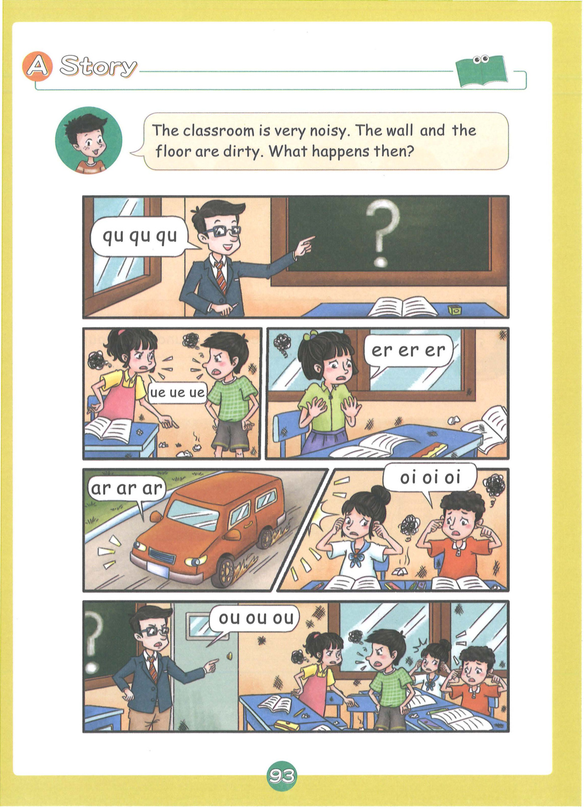
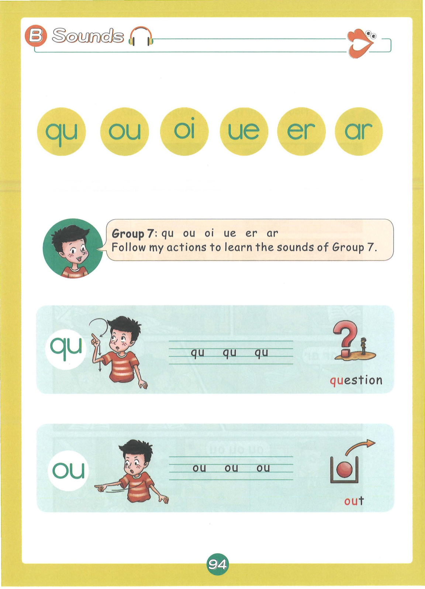
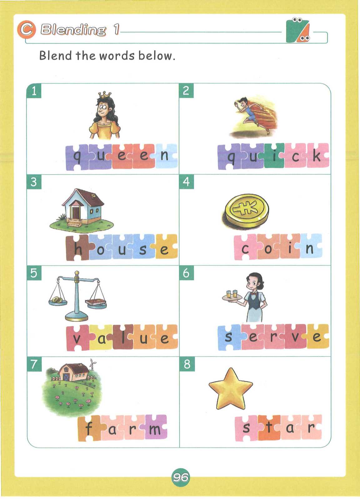
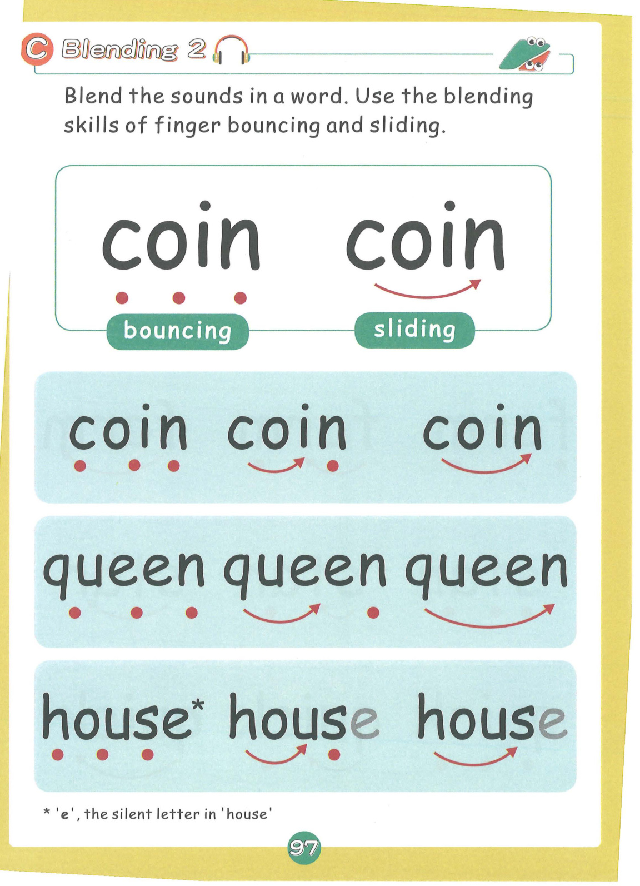
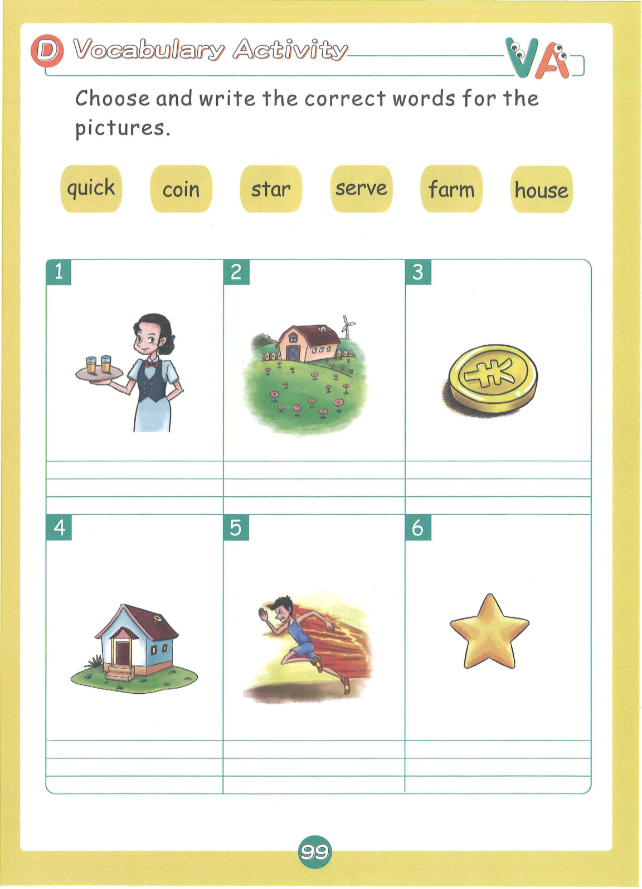
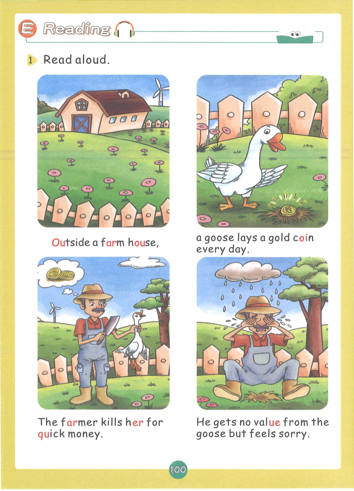
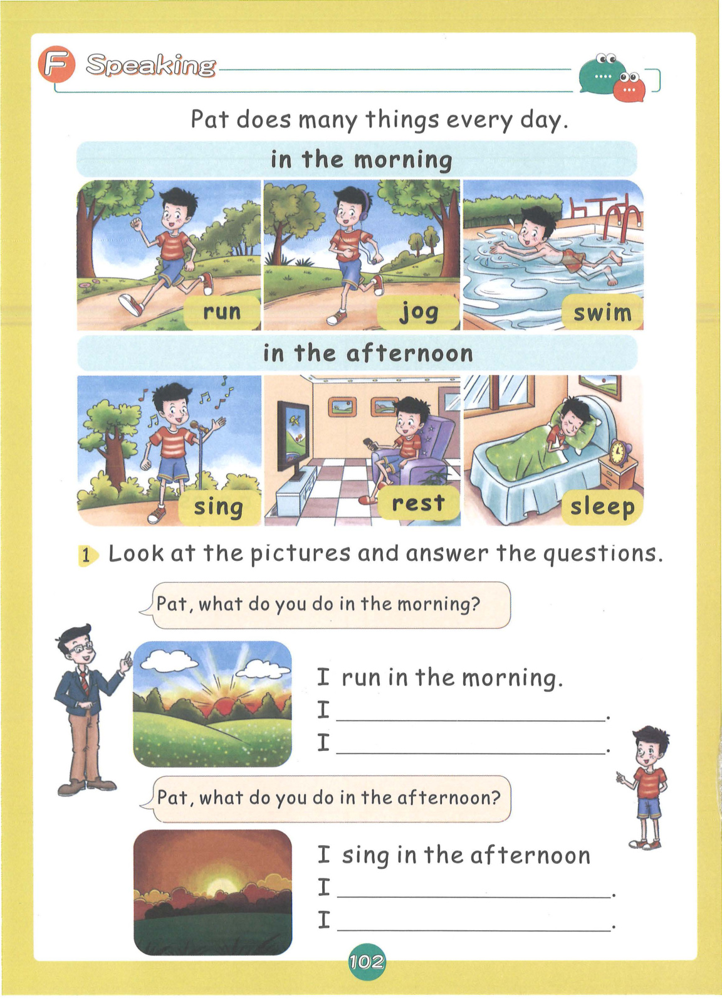
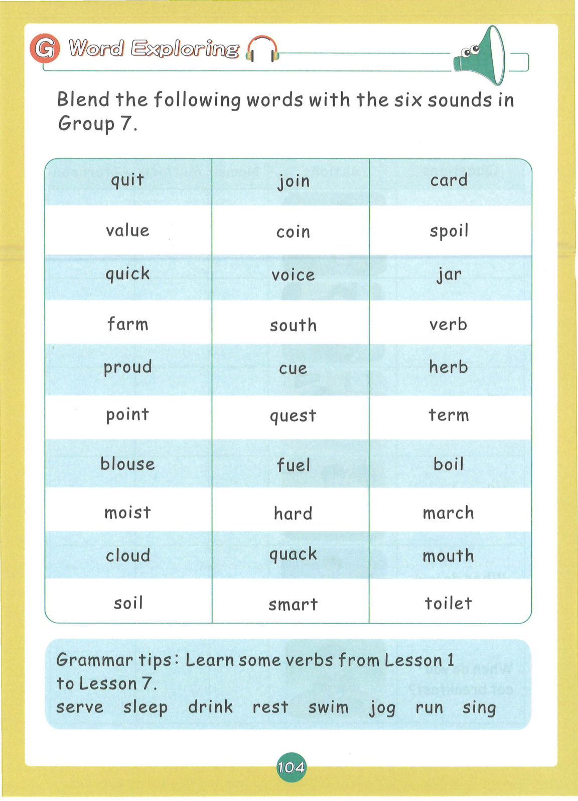

# Lesson 7: Group 7 - qu ou oi ue er ar

> **教材页码**：第 95-113 页  
> **学习内容**：6个发音：qu, ou, oi, ue, er, ar

---

## 📖 故事导入

**教材第 94 页**

### The Queen's Party

The queen has a big party. There are many blue balloons, toy cars, and lots of delicious food!

> 女王举办了一个盛大的派对。有很多蓝色气球、玩具车，还有好多好吃的食物！

---

## 🔤 发音学习

**教材第 95-97 页**

### 发音卡片

#### qu — question（问题）

- **类型**：字母组合
- **发音方法**：发/kw/的音，q总是和u一起出现，发k和w的组合音。
- **动作提示**：双手做问号形状，发出 qu-qu-qu 的声音
- **教材页码**：第 95 页

#### ou — out（外面）

- **类型**：字母组合
- **发音方法**：发/au/的双元音，从/a/滑到/u/，嘴巴从大到小。
- **动作提示**：双手做开门出去动作，发出 ou-ou-ou 的声音
- **教材页码**：第 95 页

#### oi — oil（油）

- **类型**：字母组合
- **发音方法**：发/ɔi/的双元音，从/ɔ/滑到/i/，嘴巴从圆到扁。
- **动作提示**：双手倒油动作，发出 oi-oi-oi 的声音
- **教材页码**：第 96 页

#### ue — blue（蓝色）

- **类型**：字母组合
- **发音方法**：发长元音/u:/，u发音e不发音，长而清晰。
- **动作提示**：双手做蓝色波浪动作，发出 ue-ue-ue 的长音
- **教材页码**：第 96 页

#### er — sister（姐妹）

- **类型**：R控制元音
- **发音方法**：r控制元音，发/ər/的音，中央元音加r，轻而短。
- **动作提示**：双手做姐妹手拉手动作，发出 er-er-er 的声音
- **教材页码**：第 96 页

#### ar — car（汽车）

- **类型**：R控制元音
- **发音方法**：r控制元音，发/ar/的音，嘴巴张大后接r音。
- **动作提示**：双手做开车动作，发出 ar-ar-ar 的声音
- **教材页码**：第 97 页

---

## 📝 单词释义

**教材第 97 页**

| 单词 | 中文意思 |
|------|----------|
| queen | 女王 |
| question | 问题 |
| out | 外面 |
| house | 房子 |
| oil | 油 |
| coin | 硬币 |
| blue | 蓝色 |
| glue | 胶水 |
| sister | 姐妹 |
| brother | 兄弟 |
| car | 汽车 |
| star | 星星 |

---

## 🎯 拼读练习

**教材第 98 页**

### 含 qu 的单词

- **queen** — 女王
- **question** — 问题
- **quilt** — 被子
- **quiet** — 安静的
- **quick** — 快的
- **quack** — 呱呱叫
- **quiz** — 测验
- **quote** — 引用

### 含 ou 的单词

- **out** — 外面
- **house** — 房子
- **mouse** — 老鼠
- **mouth** — 嘴巴
- **south** — 南方
- **cloud** — 云
- **count** — 数
- **brown** — 棕色的

### 含 oi 的单词

- **oil** — 油
- **coin** — 硬币
- **boil** — 煮沸
- **soil** — 土壤
- **voice** — 声音
- **noise** — 噪音
- **point** — 指向
- **join** — 加入

### 含 ue 的单词

- **blue** — 蓝色的
- **glue** — 胶水
- **true** — 真的
- **clue** — 线索
- **flute** — 长笛
- **fruit** — 水果
- **suit** — 套装
- **juice** — 果汁

### 含 er 的单词

- **sister** — 姐妹
- **brother** — 兄弟
- **father** — 父亲
- **mother** — 母亲
- **teacher** — 老师
- **water** — 水
- **river** — 河流
- **farmer** — 农民

### 含 ar 的单词

- **car** — 汽车
- **star** — 星星
- **farm** — 农场
- **park** — 公园
- **card** — 卡片
- **hard** — 困难的
- **arm** — 手臂
- **art** — 艺术

### 📚 词汇小贴士

本课核心词汇：**count, boil, join, point, quack, start**

---

## ✍️ 书写练习

**教材第 100 页**

练习书写以下单词：

- queen
- house
- coin
- blue
- car
- star

---

## 💬 句子练习

**教材第 101 页**

| 英文句子 | 中文翻译 |
|----------|----------|
| The queen has a party. | 女王举办了一个派对。 |
| The house is blue. | 房子是蓝色的。 |
| The car is red. | 汽车是红色的。 |
| My sister is tall. | 我的姐姐很高。 |
| Get out of the house! | 从房子里出去！ |
| The coin is in the soil. | 硬币在土里。 |
| I have a question. | 我有一个问题。 |
| Is it true? | 是真的吗？ |
| The stars are bright. | 星星很亮。 |
| The farmer works on the farm. | 农民在农场工作。 |

> 💡 **学习提示**：大声朗读这些句子，注意单词的拼读和句子的语调。疑问句末尾语调上升，陈述句语调下降。

---

## 🗣️ 口语运用

**教材第 103 页**

**情景话题**：你的家人

**练习对话**：

- **Teacher**: Where is...?
- **Student**: It is in/on/under...

---

## 🎵 拓展 + 儿歌

**教材第 105 页**

### ⭐ Twinkle Twinkle Little Star

Twinkle, twinkle, little star,
How I wonder what you are!
Up above the world so high,
Like a diamond in the sky.
Twinkle, twinkle, little star,
How I wonder what you are!

When the blazing sun is gone,
When he nothing shines upon,
Then you show your little light,
Twinkle, twinkle, all the night.
Twinkle, twinkle, little star,
How I wonder what you are!

### 📖 儿歌词汇

| 单词 | 中文 |
|------|------|
| star | 星星 |
| twinkle | 闪烁 |
| wonder | 想知道 |
| diamond | 钻石 |
| sky | 天空 |
| bright | 明亮的 |

---

## 🎉 本课总结

- **发音**：6个发音：qu, ou, oi, ue, er, ar
- **单词**：48+ 个单词
- **核心技能**：字母组合拼读、CVC单词拼读
- **儿歌**：⭐ Twinkle Twinkle Little Star

---

*本乐英语自然拼读 · Lesson 7 知识点整理*
