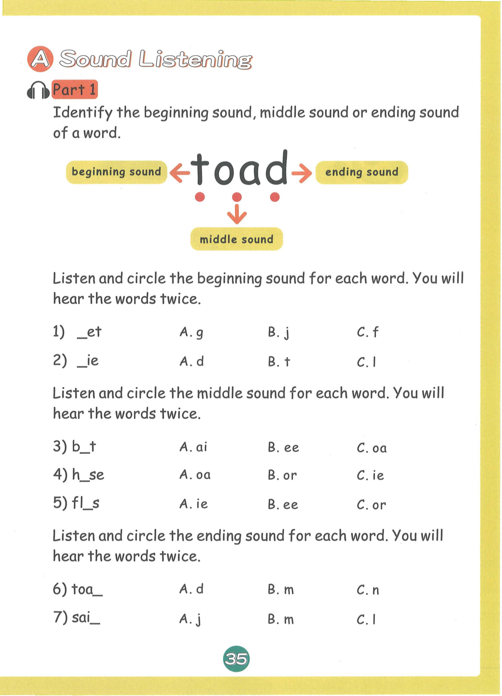
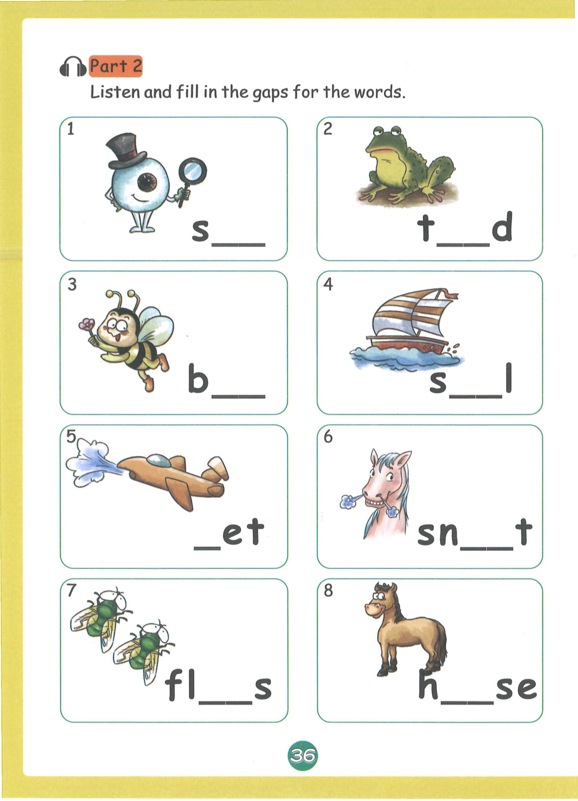
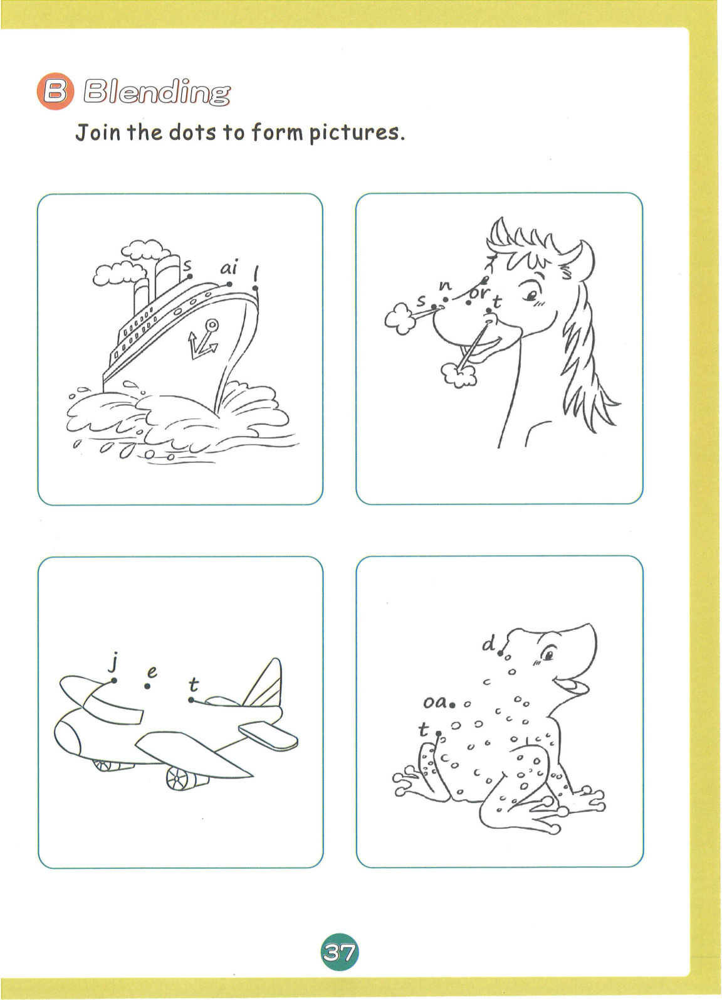
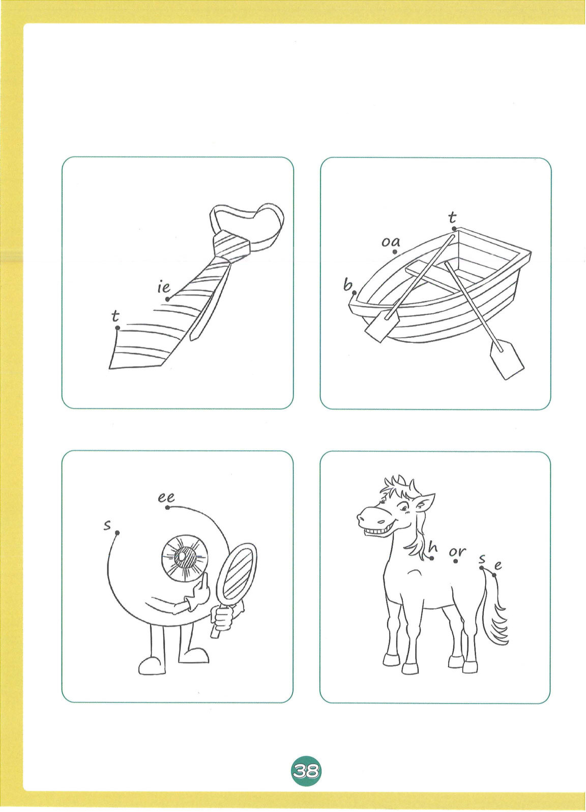
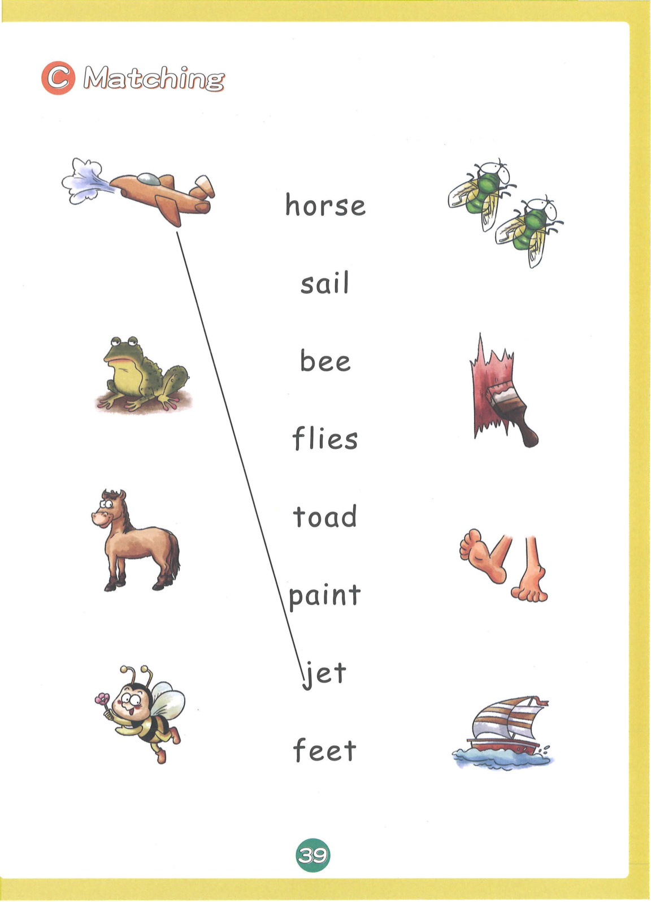
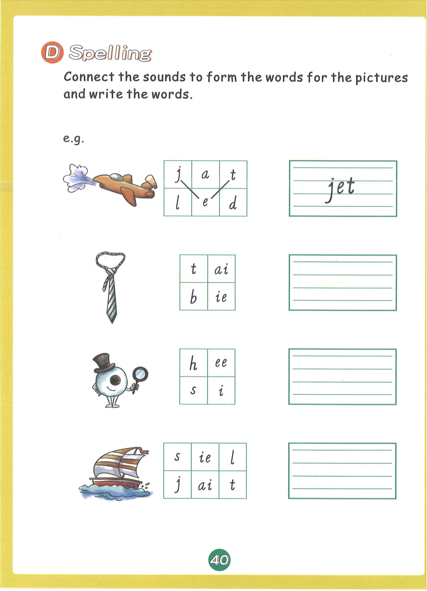
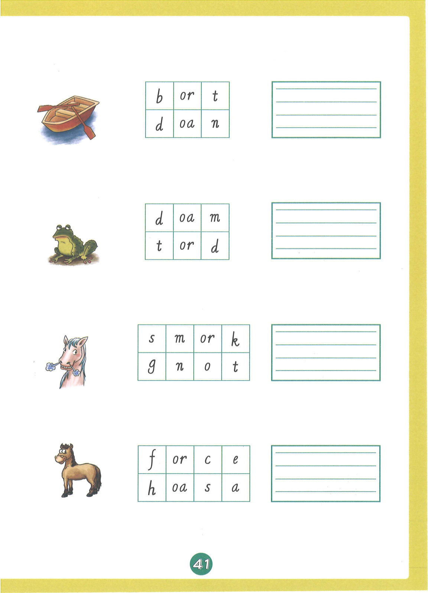
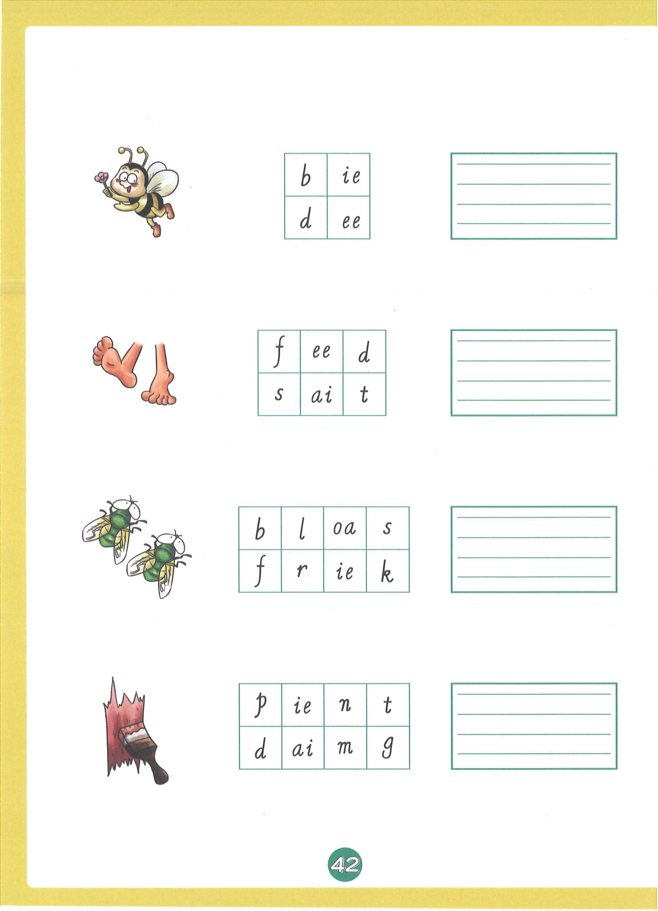
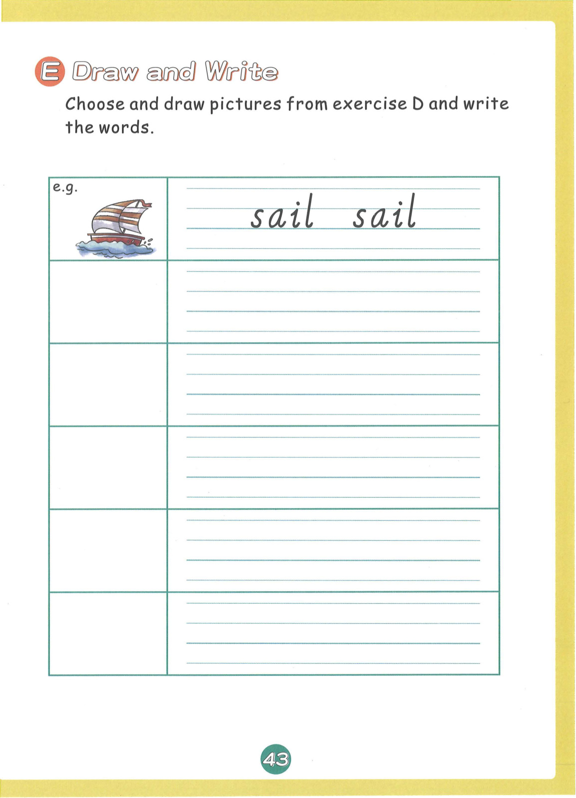
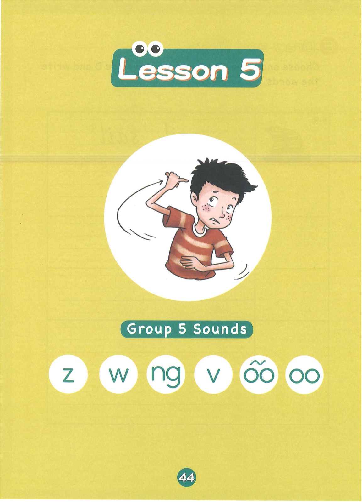

# 练习册 Lesson 4: ai j oa ie ee or

> **练习册页码**：第 36-45 页  
> **对应教材**：教材2 Lesson 4  
> **练习页数**：10 页

---

## 📝 练习说明

本课练习围绕 **ai j oa ie ee or** 这6个发音展开，包含听力、拼读、书写、阅读理解等多种题型。

---

## 📋 练习内容

### 练习页一览

| 页码 | 题型说明 |
|------|----------|
| 第36页 | 听音选词首音练习 |
| 第37页 | 听音选词中元音练习 |
| 第38页 | 听音填词尾练习 |
| 第39页 | 听音补全单词练习 |
| 第40页 | 拼读连线练习 |
| 第41页 | 看图写词练习 |
| 第42页 | 句子填空练习 |
| 第43页 | 阅读理解练习 |
| 第44页 | 听音选词首音练习 |
| 第45页 | 听音选词中元音练习 |

---

## 📖 练习页图片

### 第 36 页

---

### 第 37 页

---

### 第 38 页

---

### 第 39 页

---

### 第 40 页

---

### 第 41 页

---

### 第 42 页

---

### 第 43 页

---

### 第 44 页

---

### 第 45 页

---

## 💡 练习建议

1. **先听后做**：听力题建议先听录音，再核对答案
2. **大声拼读**：做拼读题时要大声读出来
3. **注意书写**：书写题注意字母笔顺和格式
4. **对照教材**：遇到不会的可以翻回教材对应Lesson复习

---

*本乐英语自然拼读 · 练习册2 Lesson 4*
