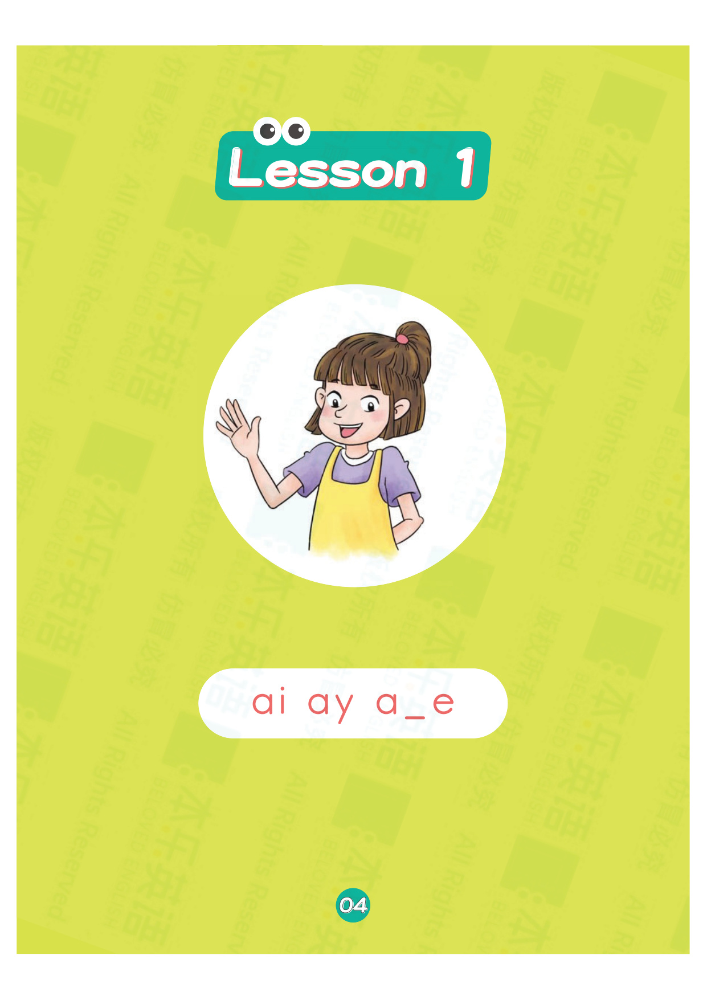
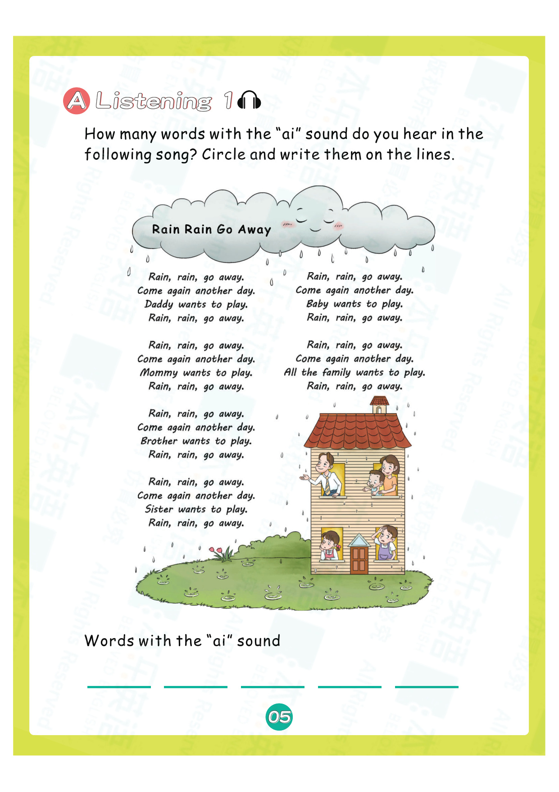
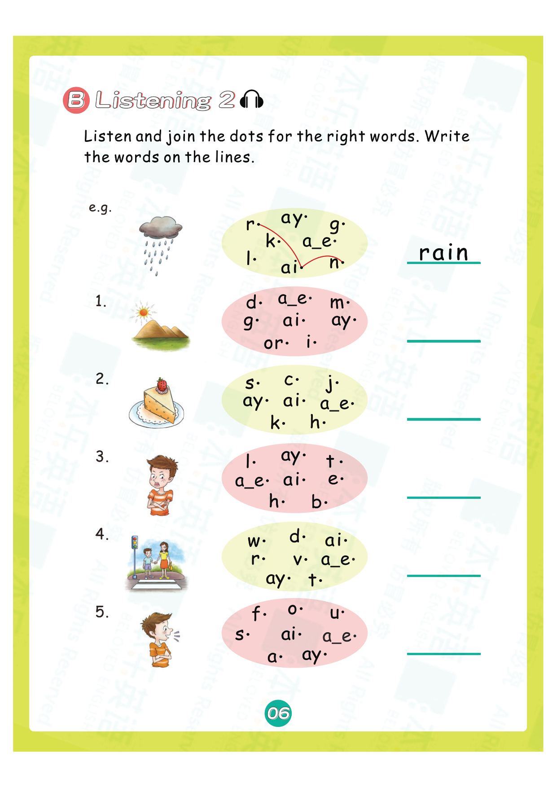
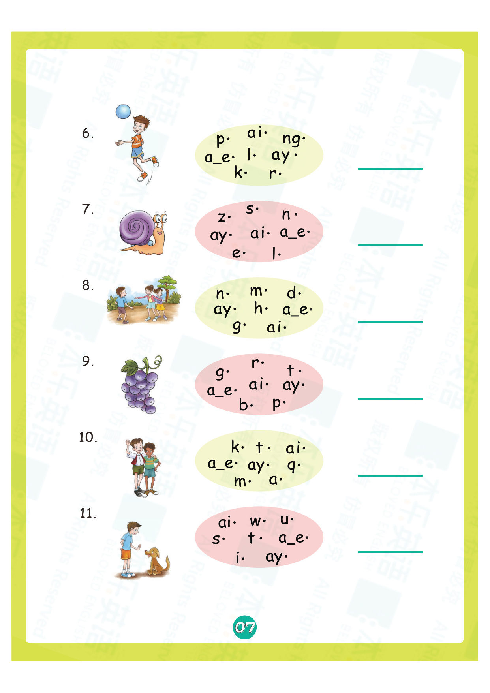
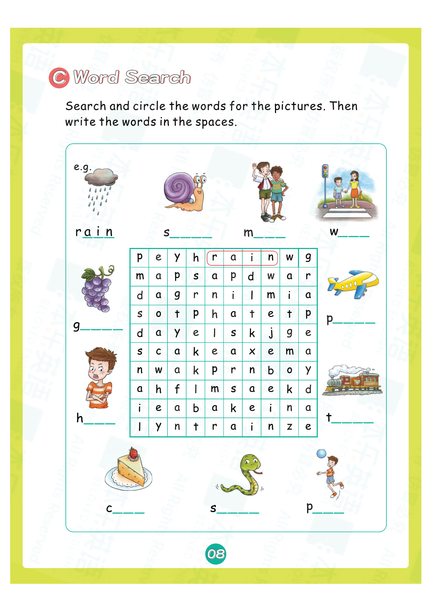
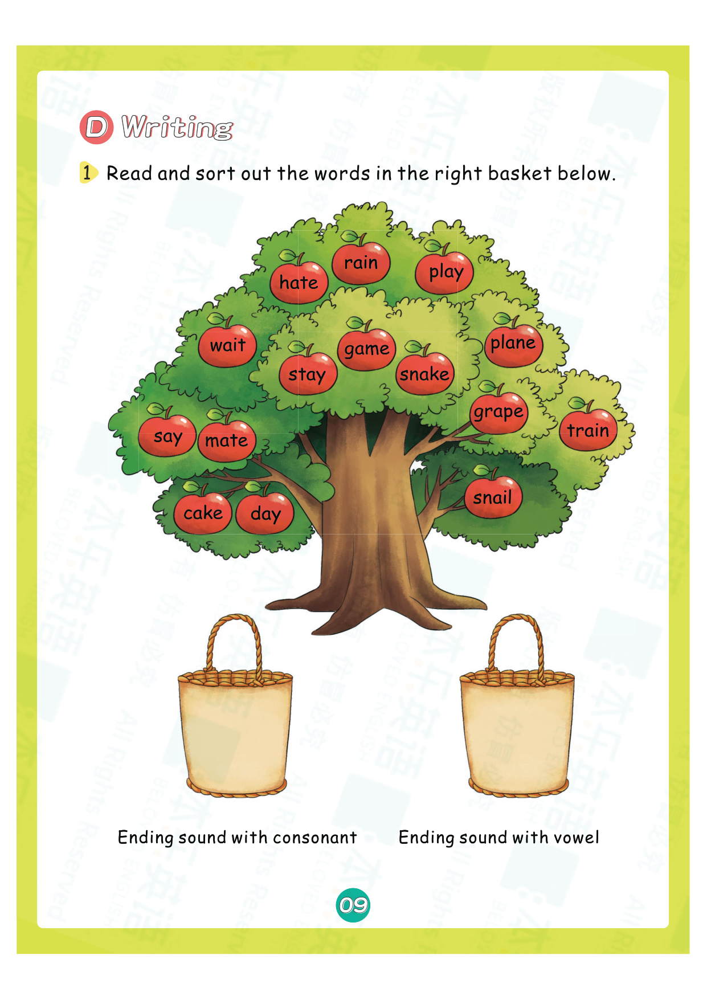
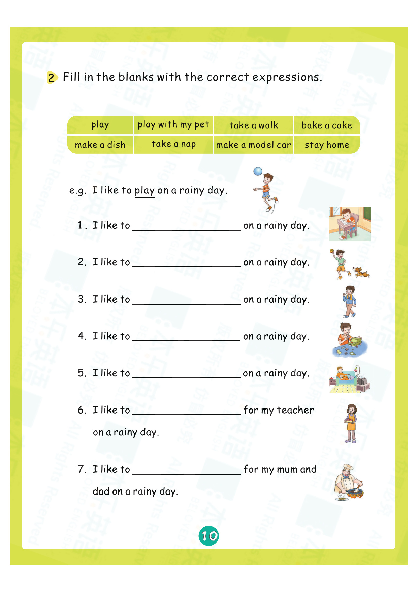
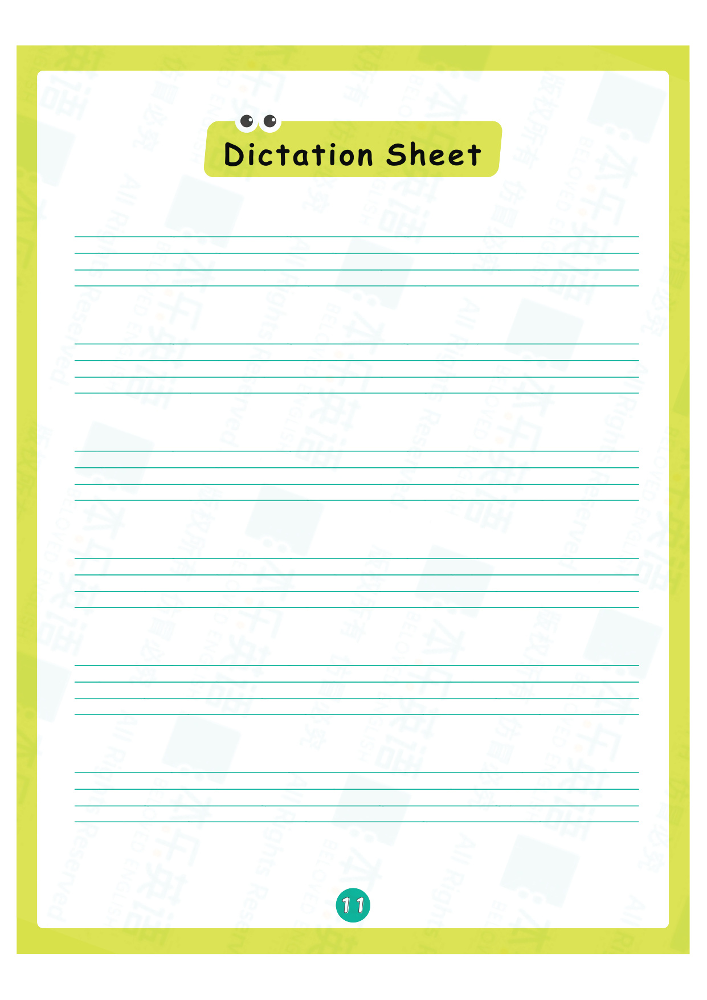
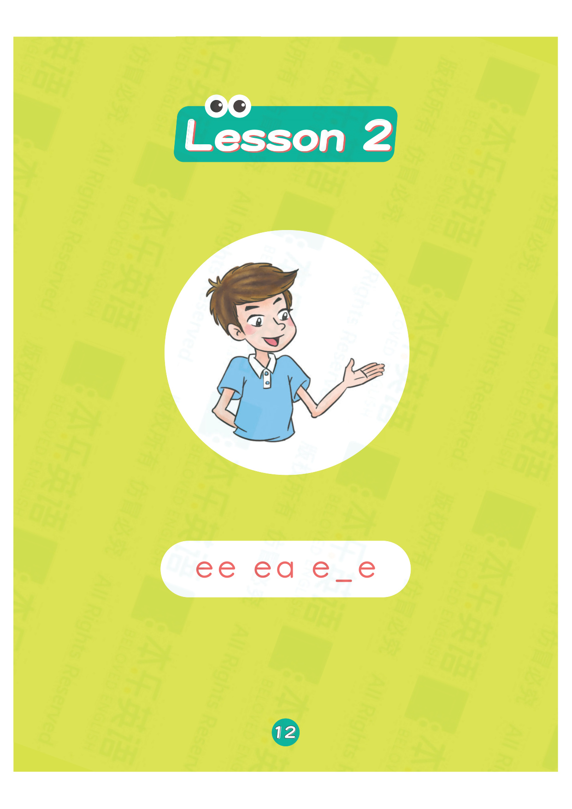
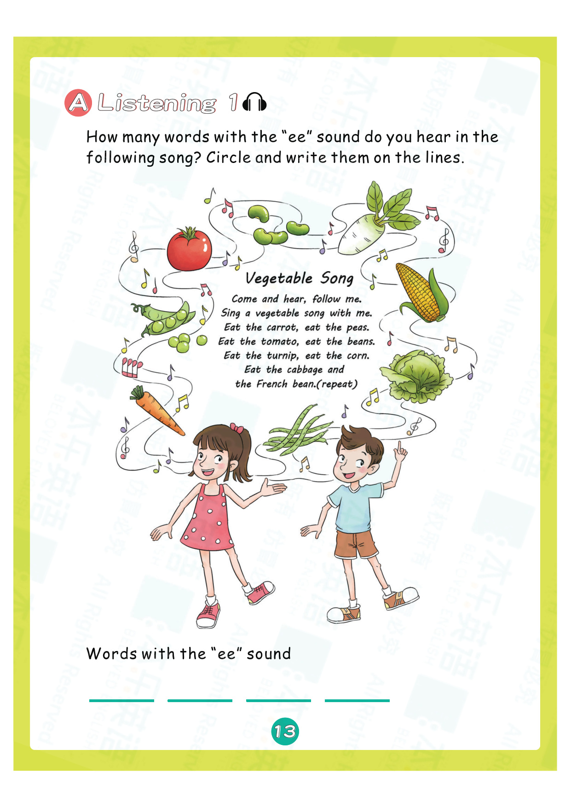

# 练习册3 Lesson 1: s a t p i n

> **练习册页码**：第 4-13 页  
> **对应教材**：教材2 Lesson 1  
> **练习页数**：10 页

---

## 📝 练习说明

本课练习围绕 **s a t p i n** 这6个发音展开，包含听力、拼读、书写、阅读理解等多种题型。

---

## 📋 练习内容一览

| 页码 | 题型说明 |
|------|----------|
| 第4页 | 听力选择练习 |
| 第5页 | 听音填空练习 |
| 第6页 | 拼读连线练习 |
| 第7页 | 看图写词练习 |
| 第8页 | 句子练习练习 |
| 第9页 | 阅读理解练习 |
| 第10页 | 听力选择练习 |
| 第11页 | 听音填空练习 |
| 第12页 | 拼读连线练习 |
| 第13页 | 看图写词练习 |

---

## 📖 练习页图片

### 第 4 页

---

### 第 5 页

---

### 第 6 页

---

### 第 7 页

---

### 第 8 页

---

### 第 9 页

---

### 第 10 页

---

### 第 11 页

---

### 第 12 页

---

### 第 13 页

---

## 💡 练习建议

1. **先听后做**：听力题建议先听录音，再核对答案
2. **大声拼读**：做拼读题时要大声读出来
3. **注意书写**：书写题注意字母笔顺和格式
4. **对照教材**：遇到不会的可以翻回教材对应Lesson复习

> 🔗 配套知识点：[教材2 Lesson 1 知识点](lesson-01.md)

---

*本乐英语自然拼读 · 练习册3 Lesson 1*
