# 练习册3 Lesson 7: qu ou oi ue er ar

> **练习册页码**：第 64-76 页  
> **对应教材**：教材2 Lesson 7  
> **练习页数**：13 页

---

## 📝 练习说明

本课练习围绕 **qu ou oi ue er ar** 这6个发音展开，包含听力、拼读、书写、阅读理解等多种题型。

---

## 📋 练习内容一览

| 页码 | 题型说明 |
|------|----------|
| 第64页 | 听力选择练习 |
| 第65页 | 听音填空练习 |
| 第66页 | 拼读连线练习 |
| 第67页 | 看图写词练习 |
| 第68页 | 句子练习练习 |
| 第69页 | 阅读理解练习 |
| 第70页 | 听力选择练习 |
| 第71页 | 听音填空练习 |
| 第72页 | 拼读连线练习 |
| 第73页 | 看图写词练习 |
| 第74页 | 句子练习练习 |
| 第75页 | 阅读理解练习 |
| 第76页 | 听力选择练习 |

---

## 📖 练习页图片

### 第 64 页

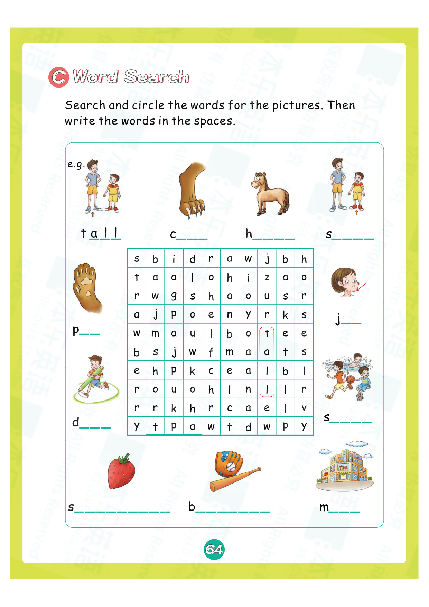

---

### 第 65 页

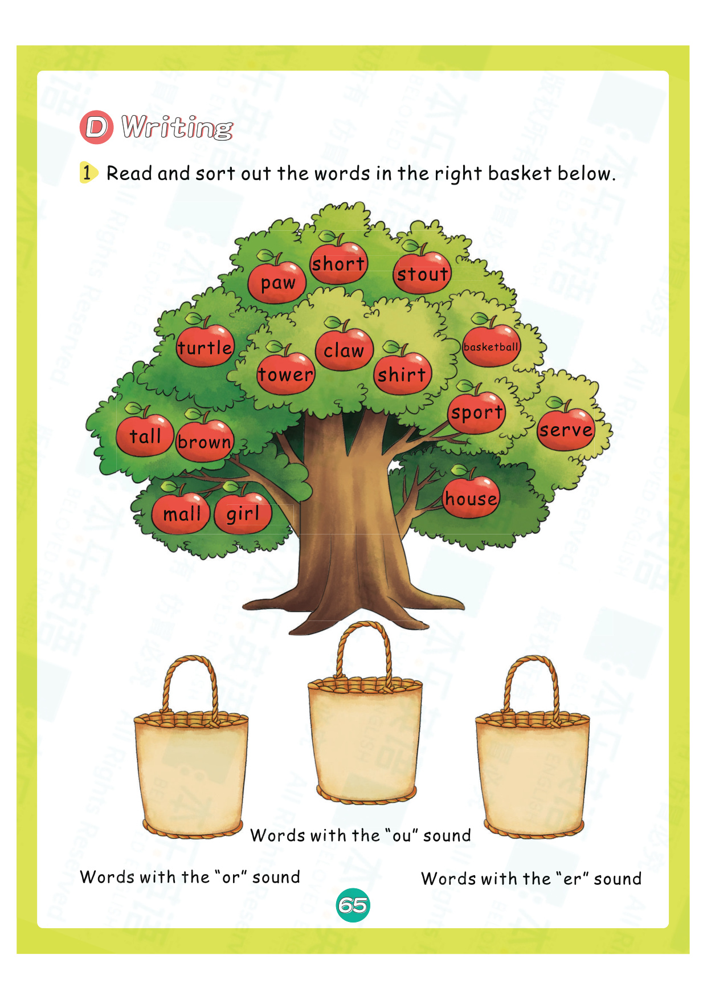

---

### 第 66 页

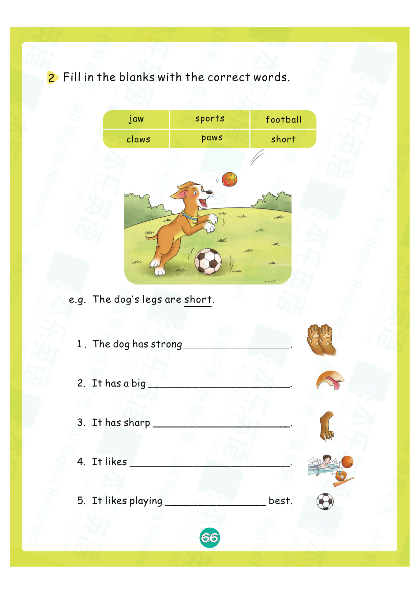

---

### 第 67 页

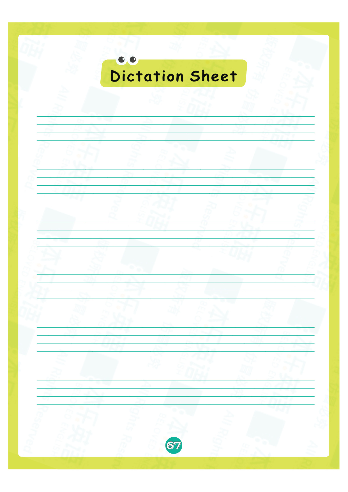

---

### 第 68 页

---

### 第 69 页

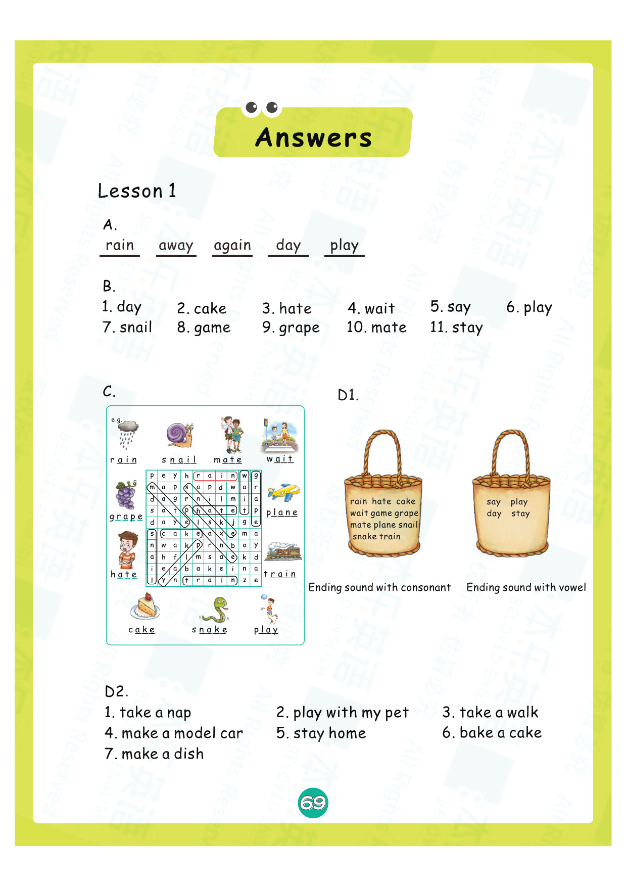

---

### 第 70 页

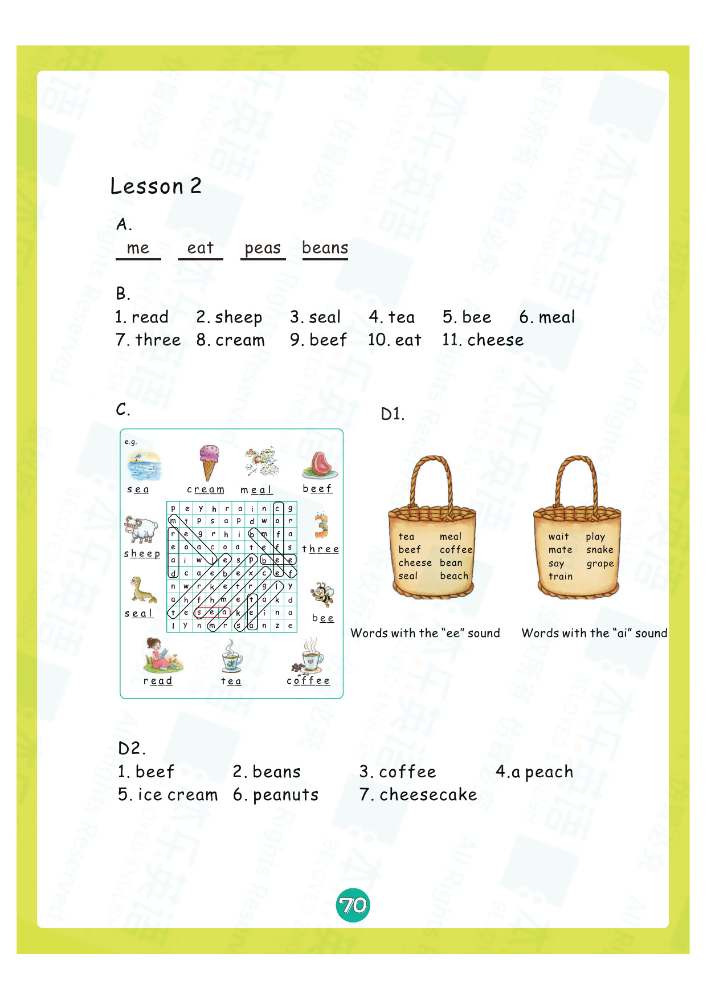

---

### 第 71 页

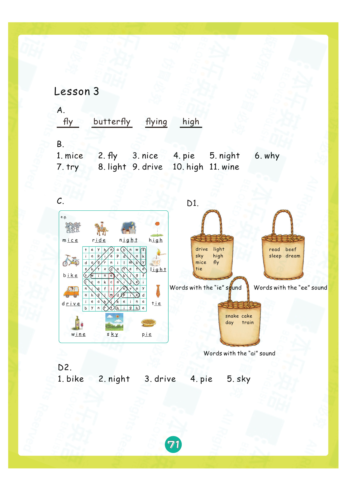

---

### 第 72 页

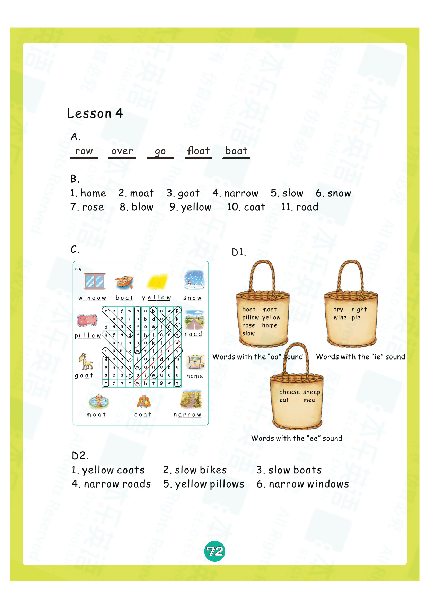

---

### 第 73 页

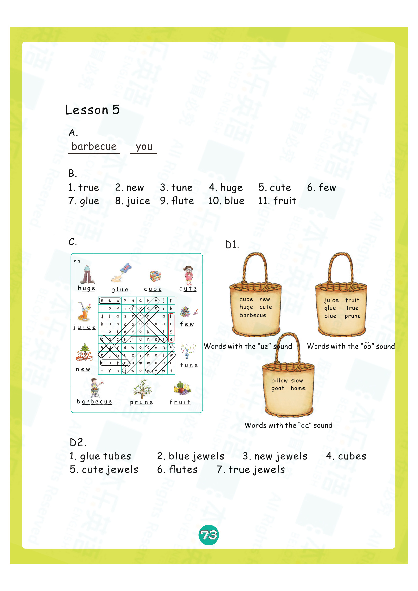

---

### 第 74 页

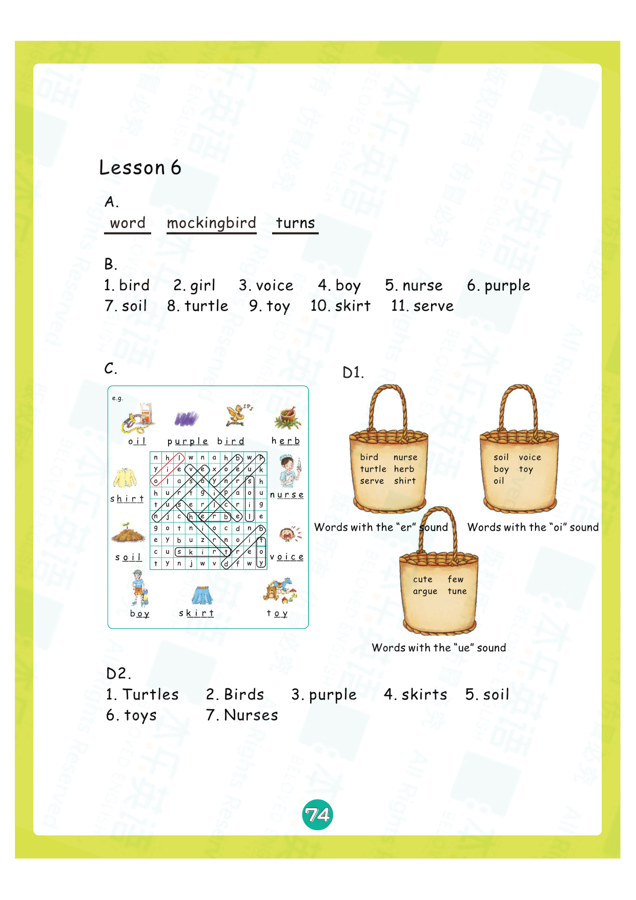

---

### 第 75 页

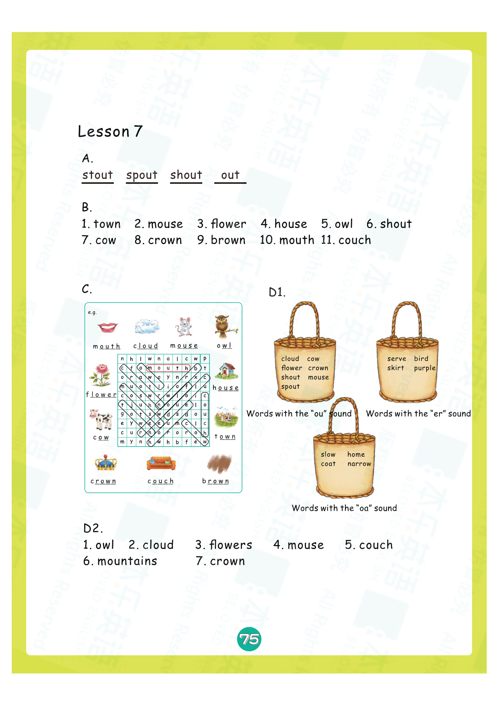

---

### 第 76 页

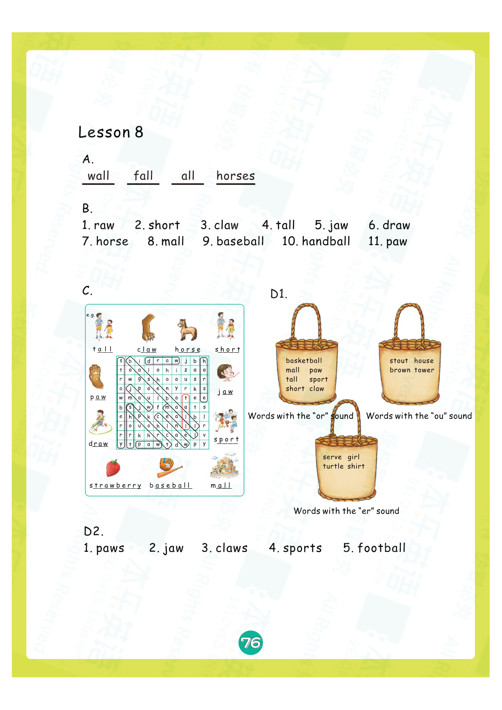

---

## 💡 练习建议

1. **先听后做**：听力题建议先听录音，再核对答案
2. **大声拼读**：做拼读题时要大声读出来
3. **注意书写**：书写题注意字母笔顺和格式
4. **对照教材**：遇到不会的可以翻回教材对应Lesson复习

> 🔗 配套知识点：[教材2 Lesson 7 知识点](lesson-07.md)

---

*本乐英语自然拼读 · 练习册3 Lesson 7*
