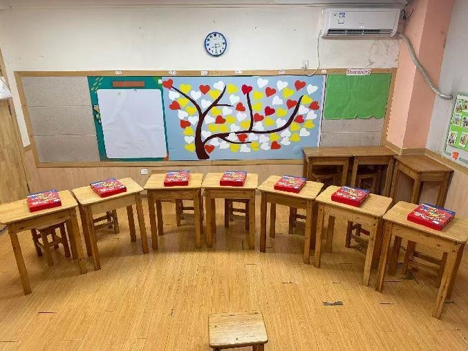

# 机构简介

  

---

## 机构全称

**阅本乐英语**

## 机构定位

阅本乐是专为 **3~14岁** 孩子提升英语和阅读能力的教育机构。

## 核心特色

- **高品质少儿高端能力体系** — 及英文大阅读体系
- **前沿的戏剧化教学法** — 源自香港的戏剧化教学方式
- **专业师资团队** — 所有老师均来自专业院校，持有专业教师资格证的全职老师

## 服务对象

3~14岁儿童及青少年，按年龄段分为：

| 年龄段 | 课程方向 |
|--------|----------|
| 3~6岁 | 幼儿听说启蒙 |
| 6~8岁 | 自然拼读 + 戏剧阅读 |
| 8~14岁 | 剑桥听说读写综合课程 |

且每个阶段搭配科学系统的英文大阅读。

## 核心优势

### 1. 以孩子为中心的学习
在阅本乐的课堂上，孩子是学习的中心和主体，老师作为引导者，引导孩子主动学习知识，孩子在与同学、老师的交流过程中建立起应对复杂问题的知识和能力。

### 2. 高品质的少儿高端能力体系
让语言回归本质，培养母语思维，拒绝哑巴英语。剑桥少儿高端能力体系简称KB体系，本课程专为小学生设计，兼顾听说读写4项能力提升与KET、PET考级，重点培养中西方思维能力，让学生具备全球胜任力。

### 3. 英语大阅读搭配系统
- **线下**：涵盖国内首家以"主题阅读"为特色的外研分级阅读馆，科学的阅读规划和专业阅读指导
- **线上**：搭配自主品牌的APP，从零基础到读哈利波特，科学系统的进阶计划，海量词汇全覆盖

### 4. 注重微习惯养成
用微习惯把听说训练和阅读习惯贯穿在英语学习的始终，每天只需要花1%的时间，1%的努力，目标1%的进步，一年之后，会比原来的自己更优秀37倍。

## 社会共识背景

近年来国家越来越重视阅读，在"全民阅读"的大趋势下，发展儿童和青少年的阅读能力，培养阅读兴趣和阅读习惯，已成为全社会的共识。

英语教育是培养国际化人才的重要途径。语言的边界就是认知的边界，学好英语不仅仅是为了应对高考，更是打开世界的一扇窗，获得更多交流的机会与提升自己的途径。同时，英语学习也有助于培养创新思维和批判性思维，更好地适应新生产力时代的发展需求。

## 校区环境

孩子们在良好、有安全感的环境中学习成长。

更多校区照片请查看 [风采展示](./10_风采展示.md#-校区环境)

---

## 规模数据

- **累计学员**：2000+ 孩子通过戏剧化教学掌握自然拼读技能
- **师资规模**：二十余名专业教师
- **校区数量**：3个校区
- **KET卓越率**：100%（2024年首次推荐参加）

---

*阅本乐 — 阅世界，阅快乐*
