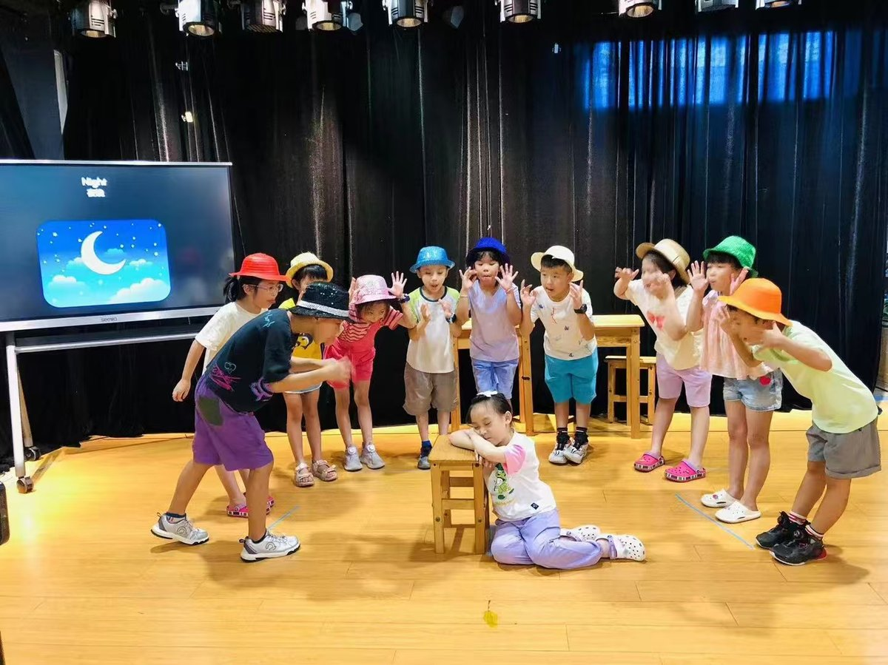
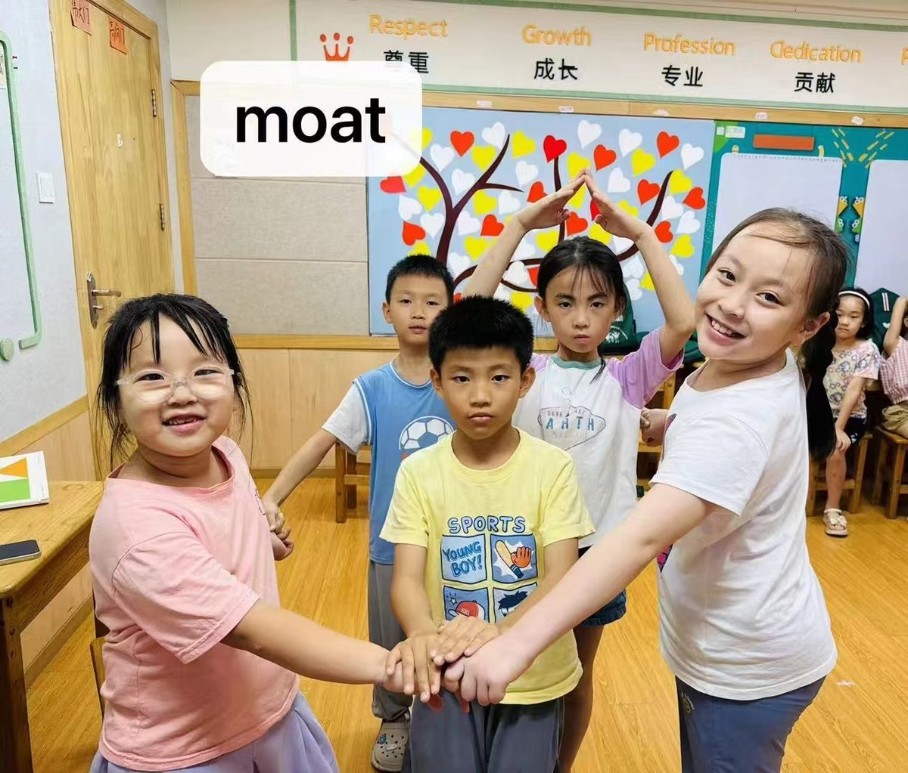
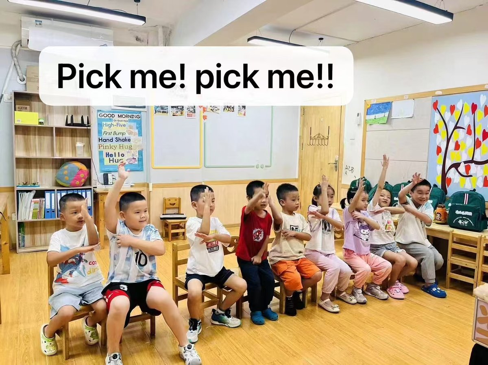
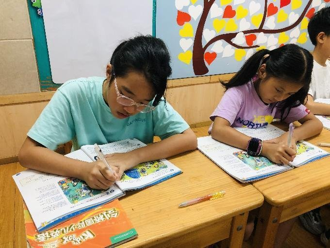
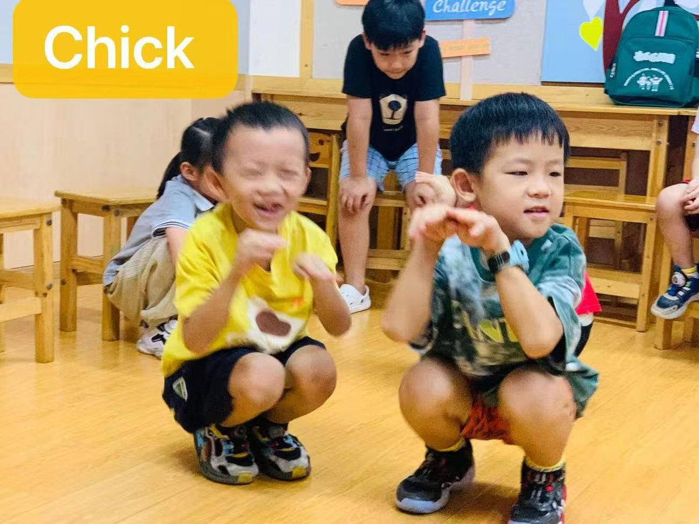
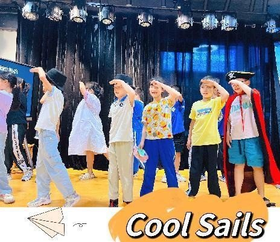
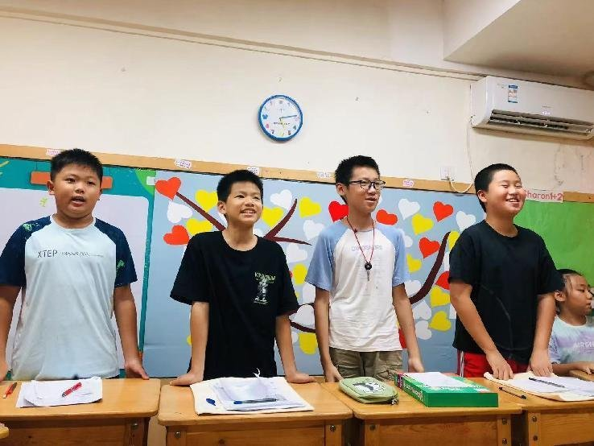

# 教学体系

---

## 教学理念

### 核心思路
**戏剧化教学，全人教育**

### 教学方法
- **启发式教学法**
- **体验式教学法**

### 教学目标
**在小学达到初高中的英语能力**

---

## 课程体系阶梯

科学规划课程阶梯，应对孩子不同成长阶段语言需求。

### 班型分类

| 班型 | 定位 | 目标 |
|------|------|------|
| 卓越班 | 对标国际考试 | 剑桥考试体系 |
| 好学班 | 对标国内新课标考试 | 校内成绩提升 |
| 寒暑班 | 专项集训 | 集中突破 |

### 各年级课程规划

#### 幼儿阶段
- **卓越班**：Big fun 听说启蒙课 → 目标：最少1000听力词汇
- **好学班**：幼儿绘本课
- **寒暑班**：绘本童谣

#### 一年级
- **卓越班**：自然拼读A + 剑桥KB1 → 对标：新课标3年级
- **好学班**：自然拼读A + 戏剧A阅读 → 对标：新课标1-2年级
- **寒暑班**：自然拼读A/B语音、戏剧阅读、剑桥KB1集训

#### 二年级
- **卓越班**：剑桥KB2 + KB3的1/3 → 对标：Starters优秀 / 新课标4年级
- **好学班**：自然拼读B + 剑桥KB1 → 对标：新课标2-3年级
- **寒暑班**：自然拼读B语音、多维阅读专项、剑桥KB2集训

#### 三年级
- **卓越班**：剑桥KB3的2/3 + KB4的1/3 → 对标：Movers / 新课标5-6年级
- **好学班**：学校课本同步 + 剑桥KB2 → 对标：新课标3-4年级
- **寒暑班**：自然拼读C语音、多维阅读专项、Movers考试集训

#### 四年级
- **卓越班**：剑桥KB4 2/3 + Complete综合教程1/3 → 对标：Flyers / 新课标6-7年级
- **好学班**：学校课本同步 + 剑桥KB3 → 对标：新课标4-5年级
- **寒暑班**：满分语法初阶班、多维阅读专项、Flyers考试集训

#### 五年级
- **卓越班**：剑桥Complete综合教程 → 对标：KET
- **好学班**：学校课本同步 + 剑桥KB4 → 对标：新课标5-6年级

---

## 四大核心特色

### 1. 以孩子为中心的学习 Children-Centered Learning
在阅本乐的课堂上，孩子是学习的中心和主体，老师作为引导者，引导孩子主动学习知识，孩子在与同学、老师的交流过程中建立起应对复杂问题的知识和能力。

### 2. 高品质的少儿高端能力体系 High-quality High-end Ability System for Children
让语言回归本质，培养母语思维，拒绝哑巴英语。剑桥少儿高端能力体系简称KB体系，本课程专为小学生设计，兼顾听说读写4项能力提升与KET、PET考级，重点培养中西方思维能力，让学生具备全球胜任力！

### 3. 英语大阅读搭配系统 English Extensive Reading System
- **线下**：涵盖国内首家以"主题阅读"为特色的外研分级阅读馆，科学的阅读规划和专业阅读指导
- **线上**：搭配自主品牌的APP，从零基础到读哈利波特，科学系统的进阶计划，海量词汇全覆盖！

### 4. 注重微习惯养成 Focus on Cultivating Mini Habits
用微习惯把听说训练和阅读习惯贯穿在英语学习的始终，每天只需要花1%的时间，1%的努力，目标1%的进步，一年之后，会比原来的自己更优秀37倍！

---

## 戏剧化教学

戏剧化课堂深受孩子们喜爱

，很多孩子因为来了阅本乐后喜欢上了学习英语，爱上了英语阅读。

### 教学特色
- 孩子们在课堂中边玩边学
- 带着对英语学习的兴趣在生活中运用
- 多数孩子在家能用简单的英语与家长互动
- 儿童剧走进了多家幼儿园和小学

### 教学成果
- 累计2000+孩子通过戏剧化教学的方式掌握了自然拼读技能
- 实现了见词能读，听音能写
- 轻松解决了英文自主阅读和单词拼写的难题

---

## 课程产品

### 幼儿课程
3~6岁听说启蒙，寓教于乐的方式培养英语兴趣

### 戏剧自然拼读
6~8岁系统学习自然拼读，见词能读，听音能写

### 戏剧阅读
6~8岁在戏剧中培养阅读能力和兴趣

### KB课程
剑桥少儿英语体系，听说读写综合能力培养

---

*阅本乐 — 戏剧化教学，全人教育*

---

## 课堂照片集锦

更多教学照片请查看 [风采展示](./10_风采展示.md#-教学课堂)

